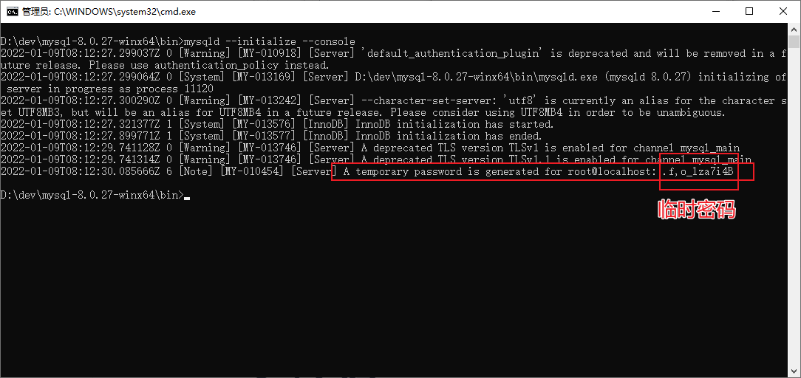
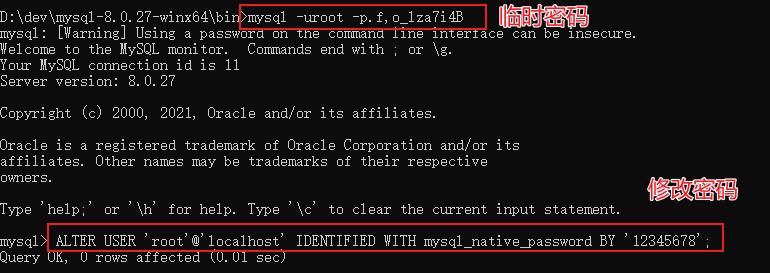

# MySql 学习大全

<!-- more -->


MySQL 是最流行的关系型数据库管理系统之一，在 WEB 应用方面是最好的 RDBMS(Relational Database Management System) 应用软件之一。

## 什么是数据库？

数据库（Database）是按照特定数据结构来组织、存储和管理数据的仓库。

虽然我们可以将数据存储在普通文件中，但当数据量庞大时，在文件中进行读写、查找和管理的效率会变得非常低下。

因此，现代应用普遍使用关系型数据库管理系统（RDBMS）来高效地存储和管理海量数据。所谓的关系型数据库，是建立在关系模型基础上的数据库，它借助于集合代数等数学概念和方法来处理数据。

### RDBMS 的特点

1.  **数据以表格的形式出现 (Table)**：这是关系型数据库的核心。
2.  **每行为一条记录 (Row/Record)**：代表一个实体的一组相关数据。
3.  **每列为一个字段 (Column/Field)**：包含同一种类型的数据。
4.  许多的行和列组成一张**表 (Table)**。
5.  若干的表组成一个**数据库 (Database)**。

## RDBMS 核心术语

-   **数据库 (Database):** 是一些关联表的集合。
-   **数据表 (Table):** 表是数据的矩阵，看起来像一个简单的电子表格。
-   **列 (Column):** 一列(数据元素) 包含了相同类型的数据, 例如邮政编码。
-   **行 (Row):** 一行（也称元组或记录）是一组相关的数据，例如一条用户信息。
-   **主键 (Primary Key):** 表中的唯一标识符。一个数据表中只能包含一个主键，用于快速查询和保证数据唯一性。
-   **外键 (Foreign Key):** 用于在一个表中引用另一个表中的记录，以建立两个表之间的关联。
-   **复合键 (Composite Key):** 将多个列组合起来作为一个主键或唯一索引。
-   **索引 (Index):** 一种特殊的数据结构，用于快速访问数据库表中的特定信息，类似于书籍的目录，可以极大地提高查询速度。
-   **参照完整性 (Referential Integrity):** 要求关系中不允许引用不存在的实体。这是保证数据一致性的重要约束。

---

## MySql 安装指南 (Windows)

### 1. 下载 MySql

访问官方下载地址: [https://dev.mysql.com/downloads/mysql/](https://dev.mysql.com/downloads/mysql/)


### 2. 解压缩

将下载的压缩包解压到一个合适的目录，注意：**路径中不能包含中文或空格**。


### 3. 配置环境变量

将 MySQL 的 `bin` 目录路径（例如 `D:\dev\mysql-8.0.27-winx64\bin`）添加到系统的 `Path` 环境变量中。


### 4. 添加配置文件 `my.ini`【选做】

> 此步骤可选，如果不创建，MySql 会使用系统默认配置。

在 MySQL 的根目录中，手动创建一个名为 `my.ini` 的文件。


将以下内容复制到 `my.ini` 中，并**务必修改 `basedir` 和 `datadir` 为你自己的实际路径**。

```properties
[mysqld]
# 设置3306端口
port=3306
# 设置mysql的安装目录
basedir=D:\\dev\\mysql-8.0.27-winx64
# 设置mysql数据库的数据的存放目录
datadir=D:\\dev\\mysql-8.0.27-winx64\\data
# 允许最大连接数
max_connections=200
# 允许连接失败的次数。这是为了防止有人从该主机试图攻击数据库系统
max_connect_errors=10
# 服务端使用的字符集默认为UTF8
character-set-server=utf8
# 创建新表时将使用的默认存储引擎
default-storage-engine=INNODB
# 默认使用"mysql_native_password"插件认证
default_authentication_plugin=mysql_native_password

[mysql]
# 设置mysql客户端默认字符集
default-character-set=utf8

[client]
# 设置mysql客户端连接服务端时默认使用的端口
port=3306
default-character-set=utf8
```

### 5. 初始化数据库

以**管理员身份**运行命令提示符 (CMD)。


在 CMD 中执行以下命令，MySQL 会进行初始化并生成一个**临时密码**，请务必复制并保存好这个密码。

```shell
mysqld --initialize --console
```



### 6. 安装 MySql 服务

继续在管理员 CMD 中执行以下命令来安装 MySQL 服务：

```shell
mysqld --install
```


### 7. 启动服务

使用以下命令启动 MySQL 服务：

```shell
net start mysql
```


### 8. 登录 MySql 并修改密码

1.  在 CMD 中，输入以下命令并按回车：
    ```shell
    mysql -uroot -p
    ```
2.  提示 `Enter password:` 后，粘贴你之前保存的**临时密码**，然后按回车。

3.  登录成功后，立即执行以下 SQL 语句来修改为您自己的新密码（例如 `12345678`）：
    ```sql
    ALTER USER 'root'@'localhost' IDENTIFIED WITH mysql_native_password BY '12345678';
    ```



### 9. 卸载 MySql（备用）

如果需要卸载 MySQL，请按以下步骤操作：

1.  **停止服务** (管理员 CMD):
    ```shell
    net stop mysql
    ```
2.  **移除服务** (管理员 CMD):
    ```shell
    mysqld --remove
    ```
3.  **手动删除** MySQL 的安装文件夹。

---

## 可视化连接工具：Navicat

为了更方便地管理数据库，我们可以使用图形化界面工具。Navicat 是其中非常流行的一款。

### 下载与安装

-   **官网下载**: [https://www.navicat.com.cn/download/navicat-premium](https://www.navicat.com.cn/download/navicat-premium)
-   **安装**: 下载后双击 `.exe` 文件，按提示进行可视化安装即可。

### 新建连接


在 Navicat 中，点击"连接" -> "MySQL"，然后输入连接名、主机（`localhost`）、端口（`3306`）、用户名（`root`）和你刚才设置的新密码，点击"连接测试"，成功后保存即可。


---

## SQL 入门

### 数据库、表、数据的关系


-   **数据库 (Database)**: 存储和管理数据的仓库，一个库可以包含多个数据表。
-   **数据表 (Table)**: 数据库中最重要的组成部分，由行和列组成，类似 Excel 表格。
-   **数据 (Data)**: 表中存储的一行行具体信息，是我们真正要管理的内容。

### SQL 语言介绍

-   **什么是 SQL?**
    -   **S**tructured **Q**uery **L**anguage，即**结构化查询语言**。
    -   它是操作所有关系型数据库的国际标准。不同的数据库可能会在标准 SQL 的基础上增加一些自己特有的语法，我们称之为"方言"。

-   **SQL 通用语法**
    -   SQL 语句可以单行或多行书写，通常以分号 (`;`) 结尾。
    -   可使用空格和缩进来增强语句的可读性。
    -   SQL 语句不区分大小写，但业界约定**关键字使用大写**，表名和列名使用小写。
    -   **注释**:
        -   单行注释: `-- 注释内容` 或 `# 注释内容` (MySQL 特有)
        -   多行注释: `/* 注释内容 */`
