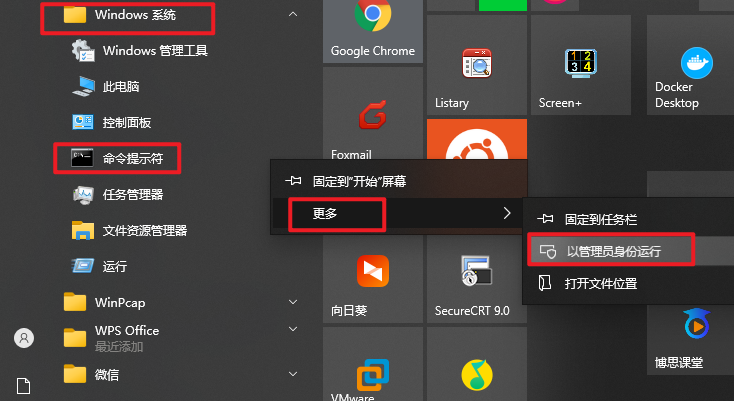
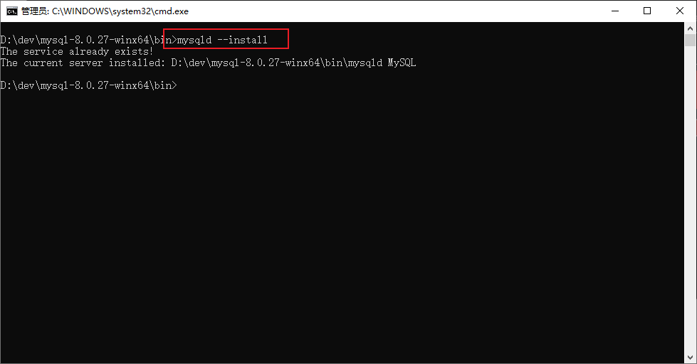
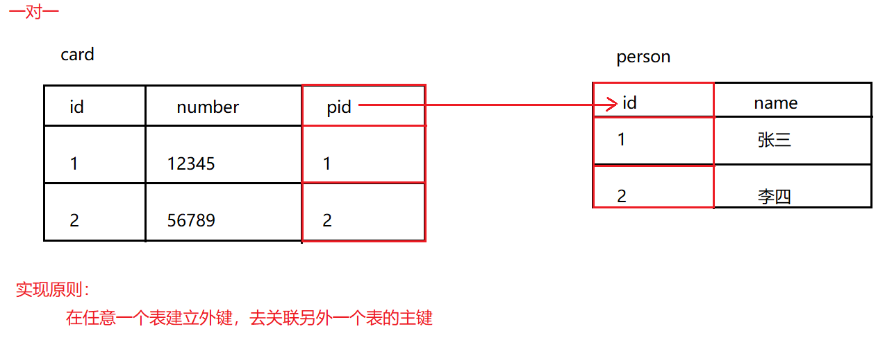
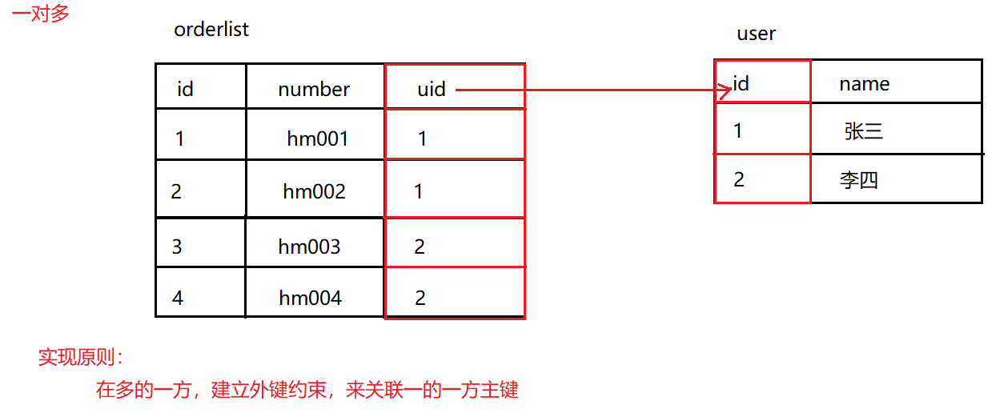
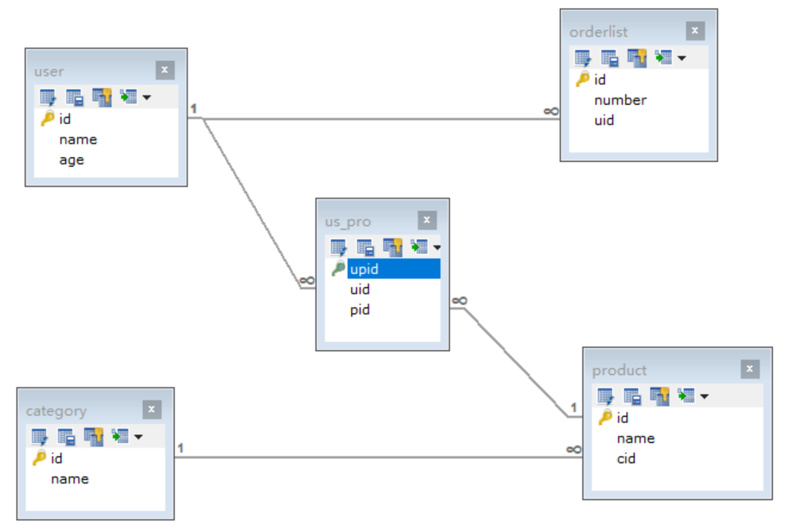
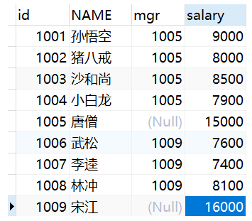
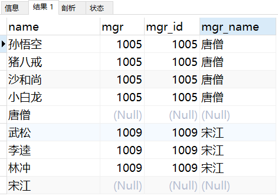
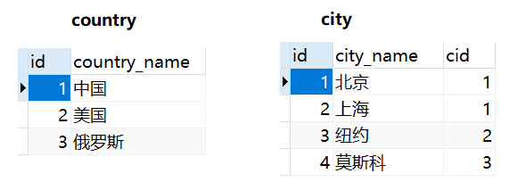

# Mysql 大全

#####

<!-- more -->


MySQL 是最流行的关系型数据库管理系统，在 WEB 应用方面 MySQL 是最好的 RDBMS(Relational Database Management System：关系数据库管理系统)应用软件之一。

## 什么是数据库

数据库（Database）是按照数据结构来组织、存储和管理数据的仓库。

每个数据库都有一个或多个不同的 API 用于创建，访问，管理，搜索和复制所保存的数据。

我们也可以将数据存储在文件中，但是在文件中读写数据速度相对较慢。

所以，现在我们使用关系型数据库管理系统（RDBMS）来存储和管理大数据量。所谓的关系型数据库，是建立在关系模型基础上的数据库，借助于集合代数等数学概念和方法来处理数据库中的数据。

RDBMS 即关系数据库管理系统(Relational Database Management System)的特点：

1. 数据以表格的形式出现

2. 每行为各种记录名称

3. 每列为记录名称所对应的数据域

4. 许多的行和列组成一张表单

5. 若干的表单组成 database

## RDBMS 术语

在我们开始学习 MySQL 数据库前，让我们先了解下 RDBMS 的一些术语：

- **数据库:** 数据库是一些关联表的集合。
- **数据表:** 表是数据的矩阵。在一个数据库中的表看起来像一个简单的电子表格。
- **列:** 一列(数据元素) 包含了相同类型的数据, 例如邮政编码的数据。
- **行：**一行（=元组，或记录）是一组相关的数据，例如一条用户订阅的数据。
- **冗余**：存储两倍数据，冗余降低了性能，但提高了数据的安全性。
- **主键**：主键是唯一的。一个数据表中只能包含一个主键。你可以使用主键来查询数据。
- **外键：**外键用于关联两个表。
- **复合键**：复合键（组合键）将多个列作为一个索引键，一般用于复合索引。
- **索引：**使用索引可快速访问数据库表中的特定信息。索引是对数据库表中一列或多列的值进行排序的一种结构。类似于书籍的目录。
- **参照完整性:** 参照的完整性要求关系中不允许引用不存在的实体。与实体完整性是关系模型必须满足的完整性约束条件，目的是保证数据的一致性。

MySQL 为关系型数据库(Relational Database Management System), 这种所谓的"关系型"可以理解为"表格"的概念, 一个关系型数据库由一个或数个表格组成, 如图所示的一个表格:

## MySQL 数据库

MySQL 是一个关系型数据库管理系统，由瑞典 MySQL AB 公司开发，目前属于 Oracle 公司。MySQL 是一种关联数据库管理系统，关联数据库将数据保存在不同的表中，而不是将所有数据放在一个大仓库内，这样就增加了速度并提高了灵活性。

- MySQL 是开源的，目前隶属于 Oracle 旗下产品。
- MySQL 支持大型的数据库。可以处理拥有上千万条记录的大型数据库。
- MySQL 使用标准的 SQL 数据语言形式。
- MySQL 可以运行于多个系统上，并且支持多种语言。这些编程语言包括 C、C++、Python、Java、Perl、PHP、Eiffel、Ruby 和 Tcl 等。
- MySQL 对 PHP 有很好的支持，PHP 是目前最流行的 Web 开发语言。
- MySQL 支持大型数据库，支持 5000 万条记录的数据仓库，32 位系统表文件最大可支持 4GB，64 位系统支持最大的表文件为 8TB。
- MySQL 是可以定制的，采用了 GPL 协议，你可以修改源码来开发自己的 MySQL 系统。

# MySql 安装

## 下载 MySql

https://dev.mysql.com/downloads/mysql/


## 解压缩

解压目录：不能有中文、空格


## 配置环境变量


## 添加 my.ini【选做】

> 本段内容可以选择不做，MySql 会使用系统默认配置

在 mysql 目录中，手动创建`my.ini`文件


复制以下内容到 my.ini，注意修改 basedir 和 datadir 的具体目录。如果要在一台电脑上安装多个 mysql 服务，则需要修改端口号

```properties
[mysqld]
# 设置3306端口
port=3306
# 设置mysql的安装目录
basedir=D:\\dev\\mysql-8.0.27-winx64
# 设置mysql数据库的数据的存放目录
datadir=D:\\dev\\mysql-8.0.27-winx64\\data
# 允许最大连接数
max_connections=200
# 允许连接失败的次数。这是为了防止有人从该主机试图攻击数据库系统
max_connect_errors=10
# 服务端使用的字符集默认为UTF8
character-set-server=utf8
# 创建新表时将使用的默认存储引擎
default-storage-engine=INNODB
# 默认使用“mysql_native_password”插件认证
#mysql_native_password
default_authentication_plugin=mysql_native_password

[mysql]
# 设置mysql客户端默认字符集
default-character-set=utf8

[client]
# 设置mysql客户端连接服务端时默认使用的端口
port=3306
default-character-set=utf8
```

## 初始化数据库

以`管理员身份运行`命令提示符（CMD）



输入以下命令，并且拷贝出来临时密码。

```
mysqld --initialize --console
```


> **临时密码：**`.f,o_lza7i4B`

```
  A temporary password is generated for root@localhost: yBSAhjA0nu,E
```

## 安装 MySql 服务

```
mysqld --install
```



## 启动服务

```
net start mysql
```


## 登录 MySql

在 cmd 中，输入以下命令，登陆 mysql，注意每个同学的临时密码都不同

```sql
-- mysql -uroot -p临时密码
mysql -uroot -p.f,o_lza7i4B

1.先输入：mysql -uroot -p  ，敲回车
2.再输入密码
```

## 修改密码

```
ALTER USER 'root'@'localhost' IDENTIFIED WITH mysql_native_password BY '12345678';
```


## 卸载 MySql（了解！！！）

1. 停止 mysql 服务：

   ```shell
   net stop mysql
   ```

2. 移除 mysql 服务：

   ```shell
   mysqld --remove
   ```

3. 手动删除安装位置的文件夹：

## 可视化连接工具 Navicat

可视化连接工具有很多种，例如：Navicat、Sqlyog，我们本次学习 Navicat

### 下载 Navicat

https://www.navicat.com.cn/download/navicat-premium


### 安装


双击 exe 文件，可视化安装即可。

### 新建连接


# Sql 入门

## 数据库、数据表、数据的关系介绍

- 数据库
  - 用于存储和管理数据的仓库
  - 一个库中可以包含多个数据表
- 数据表
  - 数据库最重要的组成部分之一
  - 它由纵向的列和横向的行组成(类似 excel 表格)
  - 可以指定列名、数据类型、约束等
  - 一个表中可以存储多条数据
- 数据
  - 想要永久化存储的数据


## SQL 介绍

- 什么是 SQL

  - Structured Query Language：结构化查询语言
  - 其实就是定义了操作所有关系型数据库的规则。每一种数据库操作的方式可能会存在一些不一样的地方，我们称为“方言”。

- SQL 通用语法

  - SQL 语句可以单行或多行书写，以分号结尾。
  - 可使用空格和缩进来增强语句的可读性。
  - MySQL 数据库的 SQL 语句不区分大小写，关键字建议使用大写。
  - 数据库的注释：
    - 单行注释：-- 注释内容 #注释内容(mysql 特有)
    - 多行注释：/_ 注释内容 _/

- SQL 分类

  - DDL(Data Definition Language)数据定义语言
    - 用来定义数据库对象：数据库，表，列等。关键字：create, drop,alter 等
  - DML(Data Manipulation Language)数据操作语言
    - 用来对数据库中表的数据进行增删改。关键字：insert, delete, update 等
  - DQL(Data Query Language)数据查询语言
    - 用来查询数据库中表的记录(数据)。关键字：select, where 等
  - DCL(Data Control Language)数据控制语言(了解)
    - 用来定义数据库的访问权限和安全级别，及创建用户。关键字：GRANT， REVOKE 等

## DDL-操作数据库

### R(Retrieve)：查询

- 查询所有数据库

```mysql
-- 查询所有数据库
SHOW DATABASES;
```


- 查询某个数据库的创建语句

```mysql
-- 标准语法
SHOW CREATE DATABASE 数据库名称;

-- 查看mysql数据库的创建格式
SHOW CREATE DATABASE mysql;
```


### C(Create)：创建

- 创建数据库

```mysql
-- 标准语法
CREATE DATABASE 数据库名称;

-- 创建db1数据库
CREATE DATABASE db1;

-- 创建一个已存在的数据库会报错
-- 错误代码：1007  Can't create database 'db1'; database exists
CREATE DATABASE db1;
```

- 创建数据库(判断，如果不存在则创建)

```mysql
-- 标准语法
CREATE DATABASE IF NOT EXISTS 数据库名称;

-- 创建数据库db2(判断，如果不存在则创建)
CREATE DATABASE IF NOT EXISTS db2;
```

- 创建数据库、并指定字符集

```mysql
-- 标准语法
CREATE DATABASE 数据库名称 CHARACTER SET 字符集名称;

-- 创建数据库db3、并指定字符集utf8
CREATE DATABASE db3 CHARACTER SET utf8;

-- 查看db3数据库的字符集
SHOW CREATE DATABASE db3;
```

- 练习：创建 db4 数据库、如果不存在则创建，指定字符集为 gbk

```mysql
-- 创建db4数据库、如果不存在则创建，指定字符集为gbk
CREATE DATABASE IF NOT EXISTS db4 CHARACTER SET gbk;

-- 查看db4数据库的字符集
SHOW CREATE DATABASE db4;
```

### U(Update)：修改

- 修改数据库的字符集

```mysql
-- 标准语法
ALTER DATABASE 数据库名称 CHARACTER SET 字符集名称;

-- 修改数据库db4的字符集为utf8
ALTER DATABASE db4 CHARACTER SET utf8;

-- 查看db4数据库的字符集
SHOW CREATE DATABASE db4;
```

### D(Delete)：删除

- 删除数据库

```mysql
-- 标准语法
DROP DATABASE 数据库名称;

-- 删除db1数据库
DROP DATABASE db1;

-- 删除一个不存在的数据库会报错
-- 错误代码：1008  Can't drop database 'db1'; database doesn't exist
DROP DATABASE db1;
```

- 删除数据库(判断，如果存在则删除)

```mysql
-- 标准语法
DROP DATABASE IF EXISTS 数据库名称;

-- 删除数据库db2，如果存在
DROP DATABASE IF EXISTS db2;
```

### 使用数据库

- 查询当前正在使用的数据库名称

```mysql
-- 查询当前正在使用的数据库
SELECT DATABASE();
```

- 使用数据库

```mysql
-- 标准语法
USE 数据库名称；

-- 使用db4数据库
USE db4;
```

## DDL-操作数据表

### R(Retrieve)：查询

- 查询数据库中所有的数据表

```mysql
-- 使用mysql数据库
USE mysql;

-- 查询库中所有的表
SHOW TABLES;
```

- 查询表结构

```mysql
-- 标准语法
DESC 表名;

-- 查询user表结构
DESC user;
```

- 查询表字符集

```mysql
-- 标准语法
SHOW TABLE STATUS FROM 库名 LIKE '表名';

-- 查看mysql数据库中user表字符集
SHOW TABLE STATUS FROM mysql LIKE 'user';
```

### C(Create)：创建

创建数据表

- 标准语法

```mysql
CREATE TABLE 表名(
    列名1 数据类型1,
    列名2 数据类型2,
    ....
    列名n 数据类型n
);
-- 注意：最后一列，不需要加逗号
```

- 数据类型

> 1. int：整数类型
>    - age int
> 2. double:小数类型
>    - score double(5,2)
>    - price double
> 3. date:日期，只包含年月日 yyyy-MM-dd
> 4. datetime:日期，包含年月日时分秒 yyyy-MM-dd HH:mm:ss
> 5. timestamp:时间戳类型 包含年月日时分秒 yyyy-MM-dd HH:mm:ss
>    - 如果将来不给这个字段赋值，或赋值为 null，则默认使用当前的系统时间，来自动赋值
> 6. char：不可变长度字符串
> 7. varchar：可变长度字符串
>
> - name varchar(20):姓名最大 20 个字符
> - zhangsan 8 个字符 张三 2 个字符

- 创建数据表

```mysql
-- 使用db3数据库
USE db3;

-- 创建一个product商品表
CREATE TABLE product(
	id INT,				-- 商品编号
	NAME VARCHAR(30),	-- 商品名称
	price DOUBLE,		-- 商品价格
	stock INT,			-- 商品库存
	insert_time DATE    -- 上架时间
)ENGINE=InnoDB DEFAULT CHARSET=utf8;
```

- 复制表

```mysql
-- 标准语法
CREATE TABLE 表名 LIKE 被复制的表名;

-- 复制product表到product2表
CREATE TABLE product2 LIKE product;
```

### U(Update)：修改

- 修改表名

```mysql
-- 标准语法
ALTER TABLE 表名 RENAME TO 新的表名;

-- 修改product2表名为product3
ALTER TABLE product2 RENAME TO product3;
```

> 不建议大家直接去修改表名
>
> 可以新建一个表，复制数据到新表即可
>
> 不要轻易删除一张表

- 修改表的字符集

```mysql
-- 标准语法
ALTER TABLE 表名 CHARACTER SET 字符集名称;

-- 查看db3数据库中product3数据表字符集
SHOW TABLE STATUS FROM db3 LIKE 'product3';
-- 修改product3数据表字符集为gbk
ALTER TABLE product3 CHARACTER SET gbk;
-- 查看db3数据库中product3数据表字符集
SHOW TABLE STATUS FROM db3 LIKE 'product3';
```

- 添加一列

```mysql
-- 标准语法
ALTER TABLE 表名 ADD 列名 数据类型;

-- 给product3表添加一列color
ALTER TABLE product3 ADD color VARCHAR(10);
```

- 修改列名称和数据类型

```mysql
-- 修改数据类型 标准语法
ALTER TABLE 表名 MODIFY 列名 新数据类型;

-- 将color数据类型修改为int
ALTER TABLE product3 MODIFY color INT;
-- 查看product3表详细信息
DESC product3;


-- 修改列名和数据类型 标准语法
ALTER TABLE 表名 CHANGE 列名 新列名 新数据类型;

-- 将color修改为address,数据类型为varchar
ALTER TABLE product3 CHANGE color address VARCHAR(30);
-- 查看product3表详细信息
DESC product3;
```

- 删除列

```mysql
-- 标准语法
ALTER TABLE 表名 DROP 列名;

-- 删除address列
ALTER TABLE product3 DROP address;
```

### D(Delete)：删除

- 删除数据表

```mysql
-- 标准语法
DROP TABLE 表名;

-- 删除product3表
DROP TABLE product3;

-- 删除不存在的表，会报错
-- 错误代码：1051  Unknown table 'product3'
DROP TABLE product3;
```

- 删除数据表(判断，如果存在则删除)

```mysql
-- 标准语法
DROP TABLE IF EXISTS 表名;

-- 删除product3表，如果存在则删除
DROP TABLE IF EXISTS product3;
```

## DML-INSERT 语句

新增表数据语法

- 新增格式 1：给指定列添加数据

```mysql
-- 标准语法
INSERT INTO 表名(列名1,列名2,...) VALUES (值1,值2,...);

-- 向product表添加一条数据
INSERT INTO product(id,NAME,price,stock,insert_time) VALUES (1,'手机',1999,22,'2099-09-09');

-- 向product表添加指定列数据
INSERT INTO product (id,NAME,price) VALUES (2,'电脑',4999);

-- 查看表中所有数据
SELECT * FROM product;
```

- 新增格式 2：默认给全部列添加数据

```mysql
-- 标准语法
INSERT INTO 表名 VALUES (值1,值2,值3,...);

-- 默认给全部列添加数据
INSERT INTO product VALUES (3,'电视',2999,18,'2099-06-06');

-- 查看表中所有数据
SELECT * FROM product;
```

- 新增格式 3：批量添加数据

```mysql
-- 默认添加所有列数据 标准语法
INSERT INTO 表名 VALUES (值1,值2,值3,...),(值1,值2,值3,...),(值1,值2,值3,...);

-- 批量添加数据
INSERT INTO product VALUES (4,'冰箱',999,26,'2099-08-08'),(5,'洗衣机',1999,32,'2099-05-10');
-- 查看表中所有数据
SELECT * FROM product;


-- 给指定列添加数据 标准语法
INSERT INTO 表名(列名1,列名2,...) VALUES (值1,值2,...),(值1,值2,...),(值1,值2,...);

-- 批量添加指定列数据
INSERT INTO product (id,NAME,price) VALUES (6,'微波炉',499),(7,'电磁炉',899);
-- 查看表中所有数据
SELECT * FROM product;
```

- 注意事项

  - 列名和值的数量以及数据类型要对应
  - 除了数字类型，其他数据类型的数据都需要加引号(单引双引都可以，推荐单引)

## DML-UPDATE 语句

- 修改表数据语法

```mysql
-- 标准语法
UPDATE 表名 SET 列名1 = 值1,列名2 = 值2,... [where 条件];

-- 修改手机的价格为3500
UPDATE product SET price=3500 WHERE NAME='手机';

-- 查看所有数据
SELECT * FROM product;

-- 修改电视的价格为1800、库存为36
UPDATE product SET price=1800,stock=36 WHERE NAME='电视';

-- 修改电磁炉的库存为10
UPDATE product SET stock=10 WHERE id=7;
```

- 注意事项
  - 修改语句中必须加条件
  - 如果不加条件，则将所有数据都修改

## DML-DELETE 语句

- 删除表数据语法

```mysql
-- 标准语法
DELETE FROM 表名 [WHERE 条件];

-- 删除product表中的微波炉信息
DELETE FROM product WHERE NAME='微波炉';

-- 删除product表中库存为10的商品信息
DELETE FROM product WHERE stock=10;

-- 查看所有商品信息
SELECT * FROM product;
```

- 注意事项
  - 删除语句中必须加条件
  - 如果不加条件，则将所有数据删除

## DQL-单表查询

- 数据准备(直接复制执行即可)

```mysql
-- 创建db1数据库
CREATE DATABASE db1;

-- 使用db1数据库
USE db1;

-- 创建数据表
CREATE TABLE product(
	id INT,				-- 商品编号
	NAME VARCHAR(20),	-- 商品名称
	price DOUBLE,		-- 商品价格
	brand VARCHAR(10),	-- 商品品牌
	stock INT,			-- 商品库存
	insert_time DATE    -- 添加时间
);

-- 添加数据
INSERT INTO product VALUES (1,'华为手机',3999,'华为',23,'2088-03-10'),
(2,'小米手机',2999,'小米',30,'2088-05-15'),
(3,'苹果手机',5999,'苹果',18,'2088-08-20'),
(4,'华为电脑',6999,'华为',14,'2088-06-16'),
(5,'小米电脑',4999,'小米',26,'2088-07-08'),
(6,'苹果电脑',8999,'苹果',15,'2088-10-25'),
(7,'联想电脑',7999,'联想',NULL,'2088-11-11');
```

- 查询语法

```mysql
select
	字段列表
from
	表名列表
where
	条件列表
group by
	分组字段
having
	分组之后的条件
order by
	排序
limit
	分页限定
```

- 查询全部

```mysql
-- 标准语法
SELECT * FROM 表名;

-- 查询product表所有数据
SELECT * FROM product;
```

- 查询部分

  - 多个字段查询

  ```mysql
  -- 标准语法
  SELECT 列名1,列名2,... FROM 表名;

  -- 查询名称、价格、品牌
  SELECT NAME,price,brand FROM product;
  ```

  - 去除重复查询
    - 注意：只有全部重复的才可以去除

  ```mysql
  -- 标准语法
  SELECT DISTINCT 列名1,列名2,... FROM 表名;

  -- 查询品牌
  SELECT brand FROM product;
  -- 查询品牌，去除重复
  SELECT DISTINCT brand FROM product;
  ```

  - 计算列的值(四则运算)

  ```mysql
  -- 标准语法
  SELECT 列名1 运算符(+ - * /) 列名2 FROM 表名;

  /*
  	计算列的值
  	标准语法：
  		SELECT 列名1 运算符(+ - * /) 列名2 FROM 表名;

  	如果某一列为null，可以进行替换
  	ifnull(表达式1,表达式2)
  	表达式1：想替换的列
  	表达式2：想替换的值
  */
  -- 查询商品名称和库存，库存数量在原有基础上加10
  SELECT NAME,stock+10 FROM product;

  -- 查询商品名称和库存，库存数量在原有基础上加10。进行null值判断
  SELECT NAME,IFNULL(stock,0)+10 FROM product;
  ```

  - 起别名

  ```mysql
  -- 标准语法
  SELECT 列名1,列名2,... AS 别名 FROM 表名;

  -- 查询商品名称和库存，库存数量在原有基础上加10。进行null值判断。起别名为getSum
  SELECT NAME,IFNULL(stock,0)+10 AS getsum FROM product;
  SELECT NAME,IFNULL(stock,0)+10 getsum FROM product;
  ```

- 条件查询

  - 条件分类

  | 符号                | 功能                                  |
  | ------------------- | ------------------------------------- |
  | >                   | 大于                                  |
  | <                   | 小于                                  |
  | >=                  | 大于等于                              |
  | <=                  | 小于等于                              |
  | =                   | 等于                                  |
  | <> 或 !=            | 不等于                                |
  | BETWEEN ... AND ... | 在某个范围之内(都包含)                |
  | IN(...)             | 多选一                                |
  | LIKE 占位符         | 模糊查询 \_单个任意字符 %多个任意字符 |
  | IS NULL             | 是 NULL                               |
  | IS NOT NULL         | 不是 NULL                             |
  | AND 或 &&           | 并且                                  |
  | OR 或 \|\|          | 或者                                  |
  | NOT 或 !            | 非，不是                              |

  - 条件查询语法

  ```mysql
  -- 标准语法
  SELECT 列名 FROM 表名 WHERE 条件;

  -- 查询库存大于20的商品信息
  SELECT * FROM product WHERE stock > 20;

  -- 查询品牌为华为的商品信息
  SELECT * FROM product WHERE brand='华为';

  -- 查询金额在4000 ~ 6000之间的商品信息
  SELECT * FROM product WHERE price >= 4000 AND price <= 6000;
  SELECT * FROM product WHERE price BETWEEN 4000 AND 6000;

  -- 查询库存为14、30、23的商品信息
  SELECT * FROM product WHERE stock=14 OR stock=30 OR stock=23;
  SELECT * FROM product WHERE stock IN(14,30,23);

  -- 查询库存为null的商品信息
  SELECT * FROM product WHERE stock IS NULL;
  -- 查询库存不为null的商品信息
  SELECT * FROM product WHERE stock IS NOT NULL;

  -- 查询名称以小米为开头的商品信息
  SELECT * FROM product WHERE NAME LIKE '小米%';

  -- 查询名称第二个字是为的商品信息
  SELECT * FROM product WHERE NAME LIKE '_为%';

  -- 查询名称为四个字符的商品信息
  SELECT * FROM product WHERE NAME LIKE '____';

  -- 查询名称中包含电脑的商品信息
  SELECT * FROM product WHERE NAME LIKE '%电脑%';
  ```

- 聚合函数

  - 将一列数据作为一个整体，进行纵向的计算
  - 聚合函数分类

  | 函数名      | 功能                             |
  | ----------- | -------------------------------- |
  | count(列名) | 统计数量(一般选用不为 null 的列) |
  | max(列名)   | 最大值                           |
  | min(列名)   | 最小值                           |
  | sum(列名)   | 求和                             |
  | avg(列名)   | 平均值                           |

  - 聚合函数语法

  ```mysql
  -- 标准语法
  SELECT 函数名(列名) FROM 表名 [WHERE 条件];

  -- 计算product表中总记录条数
  SELECT COUNT(*) FROM product;

  -- 获取最高价格
  SELECT MAX(price) FROM product;
  -- 获取最高价格的商品名称
  SELECT NAME,price FROM product WHERE price = (SELECT MAX(price) FROM product);

  -- 获取最低库存
  SELECT MIN(stock) FROM product;
  -- 获取最低库存的商品名称
  SELECT NAME,stock FROM product WHERE stock = (SELECT MIN(stock) FROM product);

  -- 获取总库存数量
  SELECT SUM(stock) FROM product;
  -- 获取品牌为苹果的总库存数量
  SELECT SUM(stock) FROM product WHERE brand='苹果';

  -- 获取品牌为小米的平均商品价格
  SELECT AVG(price) FROM product WHERE brand='小米';
  ```

- 排序查询

  - 排序分类
    - 注意：多个排序条件，当前边的条件值一样时，才会判断第二条件

  | 关键词                                       | 功能                                     |
  | -------------------------------------------- | ---------------------------------------- |
  | ORDER BY 列名 1 排序方式 1,列名 2 排序方式 2 | 对指定列排序，ASC 升序(默认的) DESC 降序 |

  - 排序语法

  ```mysql
  -- 标准语法
  SELECT 列名 FROM 表名 [WHERE 条件] ORDER BY 列名1 排序方式1,列名2 排序方式2;

  -- 按照库存升序排序
  SELECT * FROM product ORDER BY stock ASC;

  -- 查询名称中包含手机的商品信息。按照金额降序排序
  SELECT * FROM product WHERE NAME LIKE '%手机%' ORDER BY price DESC;

  -- 按照金额升序排序，如果金额相同，按照库存降序排列
  SELECT * FROM product ORDER BY price ASC,stock DESC;
  ```

- 分组查询

```mysql
-- 标准语法
SELECT 列名 FROM 表名 [WHERE 条件] GROUP BY 分组列名 [HAVING 分组后条件过滤] [ORDER BY 排序列名 排序方式];

-- 按照品牌分组，获取每组商品的总金额
SELECT brand,SUM(price) FROM product GROUP BY brand;

-- 对金额大于4000元的商品，按照品牌分组,获取每组商品的总金额
SELECT brand,SUM(price) FROM product WHERE price > 4000 GROUP BY brand;

-- 对金额大于4000元的商品，按照品牌分组，获取每组商品的总金额，只显示总金额大于7000元的
SELECT brand,SUM(price) AS getSum FROM product WHERE price > 4000 GROUP BY brand HAVING getSum > 7000;

-- 对金额大于4000元的商品，按照品牌分组，获取每组商品的总金额，只显示总金额大于7000元的、并按照总金额的降序排列
SELECT brand,SUM(price) AS getSum FROM product WHERE price > 4000 GROUP BY brand HAVING getSum > 7000 ORDER BY getSum DESC;
```

- 分页查询

```mysql
-- 标准语法
SELECT 列名 FROM 表名 [WHERE 条件] GROUP BY 分组列名 [HAVING 分组后条件过滤] [ORDER BY 排序列名 排序方式] LIMIT 开始索引,查询条数;
-- 公式：开始索引 = (当前页码-1) * 每页显示的条数

-- 每页显示2条数据
SELECT * FROM product LIMIT 0,2;  -- 第一页 开始索引=(1-1) * 2
SELECT * FROM product LIMIT 2,2;  -- 第二页 开始索引=(2-1) * 2
SELECT * FROM product LIMIT 4,2;  -- 第三页 开始索引=(3-1) * 2
SELECT * FROM product LIMIT 6,2;  -- 第四页 开始索引=(4-1) * 2
```

- 分页查询图解


# 约束

## 约束的概念和分类

- 约束的概念
  - 对表中的数据进行限定，保证数据的正确性、有效性、完整性！
- 约束的分类

| 约束                          | 说明           |
| ----------------------------- | -------------- |
| PRIMARY KEY                   | 主键约束       |
| PRIMARY KEY AUTO_INCREMENT    | 主键、自动增长 |
| UNIQUE                        | 唯一约束       |
| NOT NULL                      | 非空约束       |
| FOREIGN KEY                   | 外键约束       |
| FOREIGN KEY ON UPDATE CASCADE | 外键级联更新   |
| FOREIGN KEY ON DELETE CASCADE | 外键级联删除   |

## 主键约束

- 主键约束特点
  - 主键约束包含：`非空`和`唯一`两个功能
  - 主键一般用于表中数据的唯一标识
- 建表时添加主键约束

```mysql
-- 标准语法
CREATE TABLE 表名(
	列名 数据类型 PRIMARY KEY,
    列名 数据类型,
    ...
);

-- 创建student表
CREATE TABLE student(
	id INT PRIMARY KEY  -- 给id添加主键约束
);

-- 添加数据
INSERT INTO student VALUES (1),(2);
-- 主键默认唯一，添加重复数据，会报错
INSERT INTO student VALUES (2);
-- 主键默认非空，不能添加null的数据
INSERT INTO student VALUES (NULL);

-- 查询student表
SELECT * FROM student;
-- 查询student表详细
DESC student;
```

- 删除主键

```mysql
-- 标准语法
ALTER TABLE 表名 DROP PRIMARY KEY;

-- 删除主键
ALTER TABLE student DROP PRIMARY KEY;
```

- 建表后单独添加主键

```mysql
-- 标准语法
ALTER TABLE 表名 MODIFY 列名 数据类型 PRIMARY KEY;

-- 添加主键
ALTER TABLE student MODIFY id INT PRIMARY KEY;
```

## 主键自动增长约束

- 建表时添加主键自增约束

```mysql
-- 标准语法
CREATE TABLE 表名(
	列名 数据类型 PRIMARY KEY AUTO_INCREMENT,
    列名 数据类型,
    ...
);

-- 创建student2表
CREATE TABLE student2(
	id INT PRIMARY KEY AUTO_INCREMENT    -- 给id添加主键自增约束
);

-- 添加数据
INSERT INTO student2 VALUES (1),(2);
-- 添加null值，会自动增长
INSERT INTO student2 VALUES (NULL),(NULL);

-- 查询student2表
SELECT * FROM student2;
-- student2表详细
DESC student2;
```

- 删除自动增长

```mysql
-- 标准语法
ALTER TABLE 表名 MODIFY 列名 数据类型;

-- 删除自动增长
ALTER TABLE student2 MODIFY id INT;
```

- 建表后单独添加自动增长

```mysql
-- 标准语法
ALTER TABLE 表名 MODIFY 列名 数据类型 AUTO_INCREMENT;

-- 添加自动增长
ALTER TABLE student2 MODIFY id INT AUTO_INCREMENT;
```

## 唯一约束

- 建表时添加唯一约束

```mysql
-- 标准语法
CREATE TABLE 表名(
	列名 数据类型 UNIQUE,
    列名 数据类型,
    ...
);

-- 创建student3表
CREATE TABLE student3(
	id INT PRIMARY KEY AUTO_INCREMENT,
	tel VARCHAR(20) UNIQUE    -- 给tel列添加唯一约束
);

-- 添加数据
INSERT INTO student3 VALUES (NULL,'18888888888'),(NULL,'18666666666');
-- 添加重复数据，会报错
INSERT INTO student3 VALUES (NULL,'18666666666');

-- 查询student3数据表
SELECT * FROM student3;
-- student3表详细
DESC student3;
```

- 删除唯一约束

```mysql
-- 标准语法
ALTER TABLE 表名 DROP INDEX 列名;

-- 删除唯一约束
ALTER TABLE student3 DROP INDEX tel;
```

- 建表后单独添加唯一约束

```mysql
-- 标准语法
ALTER TABLE 表名 MODIFY 列名 数据类型 UNIQUE;

-- 添加唯一约束
ALTER TABLE student3 MODIFY tel VARCHAR(20) UNIQUE;
```

## 非空约束

- 建表时添加非空约束

```mysql
-- 标准语法
CREATE TABLE 表名(
	列名 数据类型 NOT NULL,
    列名 数据类型,
    ...
);

-- 创建student4表
CREATE TABLE student4(
	id INT PRIMARY KEY AUTO_INCREMENT,
	NAME VARCHAR(20) NOT NULL    -- 给name添加非空约束
);

-- 添加数据
INSERT INTO student4 VALUES (NULL,'张三'),(NULL,'李四');
-- 添加null值，会报错
INSERT INTO student4 VALUES (NULL,NULL);
```

- 删除非空约束

```mysql
-- 标准语法
ALTER TABLE 表名 MODIFY 列名 数据类型;

-- 删除非空约束
ALTER TABLE student4 MODIFY NAME VARCHAR(20);
```

- 建表后单独添加非空约束

```sql
-- 标准语法
ALTER TABLE 表名 MODIFY 列名 数据类型 NOT NULL;

-- 添加非空约束
ALTER TABLE student4 MODIFY NAME VARCHAR(20) NOT NULL;
```

## 外键约束

- 外键约束概念

  - 让表和表之间产生关系，从而保证数据的准确性！

- 建表时添加外键约束

  - 为什么要有外键约束

  ```mysql
  -- 创建db2数据库
  CREATE DATABASE db2;
  -- 使用db2数据库
  USE db2;

  -- 创建user用户表
  CREATE TABLE USER(
  	id INT PRIMARY KEY AUTO_INCREMENT,    -- id
  	NAME VARCHAR(20) NOT NULL             -- 姓名
  );
  -- 添加用户数据
  INSERT INTO USER VALUES (NULL,'张三'),(NULL,'李四'),(NULL,'王五');

  -- 创建orderlist订单表
  CREATE TABLE orderlist(
  	id INT PRIMARY KEY AUTO_INCREMENT,    -- id
  	number VARCHAR(20) NOT NULL,          -- 订单编号
  	uid INT                               -- 订单所属用户
  );
  -- 添加订单数据
  INSERT INTO orderlist VALUES (NULL,'hm001',1),(NULL,'hm002',1),
  (NULL,'hm003',2),(NULL,'hm004',2),
  (NULL,'hm005',3),(NULL,'hm006',3);

  -- 添加一个订单，但是没有所属用户。这合理吗？
  INSERT INTO orderlist VALUES (NULL,'hm007',8);
  -- 删除王五这个用户，但是订单表中王五还有很多个订单呢。这合理吗？
  DELETE FROM USER WHERE NAME='王五';

  -- 所以我们需要添加外键约束，让两张表产生关系
  ```

  - 外键约束格式

  ```mysql
  CONSTRAINT 外键名 FOREIGN KEY (本表外键列名) REFERENCES 主表名(主表主键列名)
  ```

  - 创建表添加外键约束

  ```mysql
  -- 创建user用户表
  CREATE TABLE USER(
  	id INT PRIMARY KEY AUTO_INCREMENT,    -- id
  	NAME VARCHAR(20) NOT NULL             -- 姓名
  );
  -- 添加用户数据
  INSERT INTO USER VALUES (NULL,'张三'),(NULL,'李四'),(NULL,'王五');

  -- 创建orderlist订单表
  CREATE TABLE orderlist(
  	id INT PRIMARY KEY AUTO_INCREMENT,    -- id
  	number VARCHAR(20) NOT NULL,          -- 订单编号
  	uid INT,                              -- 订单所属用户
  	CONSTRAINT ou_fk1 FOREIGN KEY (uid) REFERENCES USER(id)   -- 添加外键约束
  );
  -- 添加订单数据
  INSERT INTO orderlist VALUES (NULL,'hm001',1),(NULL,'hm002',1),
  (NULL,'hm003',2),(NULL,'hm004',2),
  (NULL,'hm005',3),(NULL,'hm006',3);

  -- 添加一个订单，但是没有所属用户。无法添加
  INSERT INTO orderlist VALUES (NULL,'hm007',8);
  -- 删除王五这个用户，但是订单表中王五还有很多个订单呢。无法删除
  DELETE FROM USER WHERE NAME='王五';
  ```

- 删除外键约束

```mysql
-- 标准语法
ALTER TABLE 表名 DROP FOREIGN KEY 外键名;

-- 删除外键
ALTER TABLE orderlist DROP FOREIGN KEY ou_fk1;
```

- 建表后添加外键约束

```mysql
-- 标准语法
ALTER TABLE 表名 ADD CONSTRAINT 外键名 FOREIGN KEY (本表外键列名) REFERENCES 主表名(主键列名);

-- 添加外键约束
ALTER TABLE orderlist ADD CONSTRAINT ou_fk1 FOREIGN KEY (uid) REFERENCES USER(id);
```

## 外键的级联更新和级联删除(了解)

- 什么是级联更新和级联删除
  - 当我想把 user 用户表中的某个用户删掉，我希望该用户所有的订单也随之被删除
  - 当我想把 user 用户表中的某个用户 id 修改，我希望订单表中该用户所属的订单用户编号也随之修改
- 添加级联更新和级联删除

```mysql
-- 添加外键约束，同时添加级联更新  标准语法
ALTER TABLE 表名 ADD CONSTRAINT 外键名 FOREIGN KEY (本表外键列名) REFERENCES 主表名(主键列名) ON UPDATE CASCADE;

-- 添加外键约束，同时添加级联删除  标准语法
ALTER TABLE 表名 ADD CONSTRAINT 外键名 FOREIGN KEY (本表外键列名) REFERENCES 主表名(主键列名) ON DELETE CASCADE;

-- 添加外键约束，同时添加级联更新和级联删除  标准语法
ALTER TABLE 表名 ADD CONSTRAINT 外键名 FOREIGN KEY (本表外键列名) REFERENCES 主表名(主键列名) ON UPDATE CASCADE ON DELETE CASCADE;


-- 删除外键约束
ALTER TABLE orderlist DROP FOREIGN KEY ou_fk1;

-- 添加外键约束，同时添加级联更新和级联删除
ALTER TABLE orderlist ADD CONSTRAINT ou_fk1 FOREIGN KEY (uid) REFERENCES USER(id) ON UPDATE CASCADE ON DELETE CASCADE;

-- 将王五用户的id修改为5    订单表中的uid也随之被修改
UPDATE USER SET id=5 WHERE id=3;

-- 将王五用户删除     订单表中该用户所有订单也随之删除
DELETE FROM USER WHERE id=5;
```

# 多表设计

## 一对一(了解)

- 分析
  - 人和身份证。一个人只有一个身份证，一个身份证只能对应一个人！
- 实现原则
  - 在任意一个表建立`外键`，去关联另外一个表的`主键`
- SQL 演示

```mysql
-- 创建db5数据库
CREATE DATABASE db5;
-- 使用db5数据库
USE db5;

-- 创建person表
CREATE TABLE person(
	id INT PRIMARY KEY AUTO_INCREMENT,
	NAME VARCHAR(20)
);
-- 添加数据
INSERT INTO person VALUES (NULL,'张三'),(NULL,'李四');

-- 创建card表
CREATE TABLE card(
	id INT PRIMARY KEY AUTO_INCREMENT,
	number VARCHAR(50),
	pid INT UNIQUE,
	CONSTRAINT cp_fk1 FOREIGN KEY (pid) REFERENCES person(id) -- 添加外键
);
-- 添加数据
INSERT INTO card VALUES (NULL,'12345',1),(NULL,'56789',2);
```

- 图解



## 一对多

- 分析
  - 用户和订单。一个用户可以有多个订单！
  - 商品分类和商品。一个分类下可以有多个商品！
- 实现原则
  - 在多的一方，建立外键约束，来关联一的一方主键
- SQL 演示

```mysql
/*
	用户和订单
*/
-- 创建user表
CREATE TABLE USER(
	id INT PRIMARY KEY AUTO_INCREMENT,
	NAME VARCHAR(20)
);
-- 添加数据
INSERT INTO USER VALUES (NULL,'张三'),(NULL,'李四');

-- 创建orderlist表
CREATE TABLE orderlist(
	id INT PRIMARY KEY AUTO_INCREMENT,
	number VARCHAR(20),
	uid INT,
	CONSTRAINT ou_fk1 FOREIGN KEY (uid) REFERENCES USER(id)  -- 添加外键约束
);
-- 添加数据
INSERT INTO orderlist VALUES (NULL,'hm001',1),(NULL,'hm002',1),(NULL,'hm003',2),(NULL,'hm004',2);


/*
	商品分类和商品
*/
-- 创建category表
CREATE TABLE category(
	id INT PRIMARY KEY AUTO_INCREMENT,
	NAME VARCHAR(10)
);
-- 添加数据
INSERT INTO category VALUES (NULL,'手机数码'),(NULL,'电脑办公');

-- 创建product表
CREATE TABLE product(
	id INT PRIMARY KEY AUTO_INCREMENT,
	NAME VARCHAR(30),
	cid INT,
	CONSTRAINT pc_fk1 FOREIGN KEY (cid) REFERENCES category(id)  -- 添加外键约束
);
-- 添加数据
INSERT INTO product VALUES (NULL,'华为P30',1),(NULL,'小米note3',1),
(NULL,'联想电脑',2),(NULL,'苹果电脑',2);
```

- 图解



## 多对多

- 分析
  - 学生和课程。一个学生可以选择多个课程，一个课程也可以被多个学生选择！
- 实现原则
  - 需要借助`第三张表`中间表，中间表至少包含两个列，这两个列作为中间表的外键，分别关联两张表的主键
- SQL 演示

```mysql
-- 创建student表
CREATE TABLE student(
	id INT PRIMARY KEY AUTO_INCREMENT,
	NAME VARCHAR(20)
);
-- 添加数据
INSERT INTO student VALUES (NULL,'张三'),(NULL,'李四');

-- 创建course表
CREATE TABLE course(
	id INT PRIMARY KEY AUTO_INCREMENT,
	NAME VARCHAR(10)
);
-- 添加数据
INSERT INTO course VALUES (NULL,'语文'),(NULL,'数学');

-- 创建中间表
CREATE TABLE stu_course(
	id INT PRIMARY KEY AUTO_INCREMENT,
	sid INT, -- 用于和student表的id进行外键关联
	cid INT, -- 用于和course表的id进行外键关联
	CONSTRAINT sc_fk1 FOREIGN KEY (sid) REFERENCES student(id), -- 添加外键约束
	CONSTRAINT sc_fk2 FOREIGN KEY (cid) REFERENCES course(id)   -- 添加外键约束
);
-- 添加数据
INSERT INTO stu_course VALUES (NULL,1,1),(NULL,1,2),(NULL,2,1),(NULL,2,2);
```

- 图解


# 多表查询

## 多表查询-数据准备

### 创建表

- user （用户表）
- orderlist （订单列表）
- category （商品分类）
- product （商品）
- us_pro （用户和商品的中间表）

### SQL 语句

```mysql
-- 创建db6数据库
CREATE DATABASE db6;
-- 使用db6数据库
USE db6;

-- 创建user表
CREATE TABLE USER(
	id INT PRIMARY KEY AUTO_INCREMENT,	-- 用户id
	NAME VARCHAR(20),			        -- 用户姓名
	age INT                             -- 用户年龄
);
-- 添加数据
INSERT INTO USER VALUES (1,'张三',23);
INSERT INTO USER VALUES (2,'李四',24);
INSERT INTO USER VALUES (3,'王五',25);
INSERT INTO USER VALUES (4,'赵六',26);


-- 订单表
CREATE TABLE orderlist(
	id INT PRIMARY KEY AUTO_INCREMENT,	-- 订单id
	number VARCHAR(30),					-- 订单编号
	uid INT,    -- 外键字段
	CONSTRAINT ou_fk1 FOREIGN KEY (uid) REFERENCES USER(id)
);
-- 添加数据
INSERT INTO orderlist VALUES (1,'hm001',1);
INSERT INTO orderlist VALUES (2,'hm002',1);
INSERT INTO orderlist VALUES (3,'hm003',2);
INSERT INTO orderlist VALUES (4,'hm004',2);
INSERT INTO orderlist VALUES (5,'hm005',3);
INSERT INTO orderlist VALUES (6,'hm006',3);
INSERT INTO orderlist VALUES (7,'hm007',NULL);


-- 商品分类表
CREATE TABLE category(
	id INT PRIMARY KEY AUTO_INCREMENT,  -- 商品分类id
	NAME VARCHAR(10)                    -- 商品分类名称
);
-- 添加数据
INSERT INTO category VALUES (1,'手机数码');
INSERT INTO category VALUES (2,'电脑办公');
INSERT INTO category VALUES (3,'烟酒茶糖');
INSERT INTO category VALUES (4,'鞋靴箱包');


-- 商品表
CREATE TABLE product(
	id INT PRIMARY KEY AUTO_INCREMENT,   -- 商品id
	NAME VARCHAR(30),                    -- 商品名称
	cid INT, -- 外键字段
	CONSTRAINT cp_fk1 FOREIGN KEY (cid) REFERENCES category(id)
);
-- 添加数据
INSERT INTO product VALUES (1,'华为手机',1);
INSERT INTO product VALUES (2,'小米手机',1);
INSERT INTO product VALUES (3,'联想电脑',2);
INSERT INTO product VALUES (4,'苹果电脑',2);
INSERT INTO product VALUES (5,'中华香烟',3);
INSERT INTO product VALUES (6,'玉溪香烟',3);
INSERT INTO product VALUES (7,'计生用品',NULL);


-- 中间表
CREATE TABLE us_pro(
	upid INT PRIMARY KEY AUTO_INCREMENT,  -- 中间表id
	uid INT, -- 外键字段。需要和用户表的主键产生关联
	pid INT, -- 外键字段。需要和商品表的主键产生关联
	CONSTRAINT up_fk1 FOREIGN KEY (uid) REFERENCES USER(id),
	CONSTRAINT up_fk2 FOREIGN KEY (pid) REFERENCES product(id)
);
-- 添加数据
INSERT INTO us_pro VALUES (NULL,1,1);
INSERT INTO us_pro VALUES (NULL,1,2);
INSERT INTO us_pro VALUES (NULL,1,3);
INSERT INTO us_pro VALUES (NULL,1,4);
INSERT INTO us_pro VALUES (NULL,1,5);
INSERT INTO us_pro VALUES (NULL,1,6);
INSERT INTO us_pro VALUES (NULL,1,7);
INSERT INTO us_pro VALUES (NULL,2,1);
INSERT INTO us_pro VALUES (NULL,2,2);
INSERT INTO us_pro VALUES (NULL,2,3);
INSERT INTO us_pro VALUES (NULL,2,4);
INSERT INTO us_pro VALUES (NULL,2,5);
INSERT INTO us_pro VALUES (NULL,2,6);
INSERT INTO us_pro VALUES (NULL,2,7);
INSERT INTO us_pro VALUES (NULL,3,1);
INSERT INTO us_pro VALUES (NULL,3,2);
INSERT INTO us_pro VALUES (NULL,3,3);
INSERT INTO us_pro VALUES (NULL,3,4);
INSERT INTO us_pro VALUES (NULL,3,5);
INSERT INTO us_pro VALUES (NULL,3,6);
INSERT INTO us_pro VALUES (NULL,3,7);
INSERT INTO us_pro VALUES (NULL,4,1);
INSERT INTO us_pro VALUES (NULL,4,2);
INSERT INTO us_pro VALUES (NULL,4,3);
INSERT INTO us_pro VALUES (NULL,4,4);
INSERT INTO us_pro VALUES (NULL,4,5);
INSERT INTO us_pro VALUES (NULL,4,6);
INSERT INTO us_pro VALUES (NULL,4,7);
```

- 架构器图解



## 连接查询图示


## 多表查询-笛卡尔积查询(了解)

- 有两张表，获取这两个表的所有组合情况
- 要完成多表查询，需要消除这些没有用的数据
- 多表查询格式

```mysql
SELECT
	列名列表
FROM
	表名列表
WHERE
	条件...
```

- 笛卡尔积查询

```mysql
-- 标准语法
SELECT 列名 FROM 表名1,表名2,...;

-- 查询user表和orderlist表
SELECT * FROM USER,orderlist;
```

## 多表查询-内连接查询

- 查询原理
  - 内连接查询的是两张表有交集的部分数据(有主外键关联的数据)
- 显式内连接

```mysql
-- 标准语法
SELECT 列名 FROM 表名1 [INNER] JOIN 表名2 ON 条件;

-- 查询用户信息和对应的订单信息
SELECT * FROM USER INNER JOIN orderlist ON user.id=orderlist.uid;
SELECT * FROM USER JOIN orderlist ON user.id=orderlist.uid;

-- 查询用户信息和对应的订单信息，起别名
SELECT * FROM USER u JOIN orderlist o ON u.id=o.uid;

-- 查询用户姓名，年龄。和订单编号
SELECT
	u.id,
	u.`NAME`,
	u.age,
	o.id oid,
	o.number
FROM
	`USER` u
INNER JOIN
	orderlist o
ON
	u.id = o.uid;
```

- 隐式内连接

```mysql
-- 标准语法
SELECT 列名 FROM 表名1,表名2 WHERE 条件;

-- 查询用户姓名，年龄。和订单编号
SELECT
	u.`name`,	-- 姓名
	u.`age`,	-- 年龄
	o.`number`	-- 订单编号
FROM
	USER u,		-- 用户表
	orderlist o     -- 订单表
WHERE
	u.`id`=o.`uid`;
```

## 多表查询-外连接查询

- 左外连接

  - 查询原理
    - 查询左表的全部数据，和左右两张表有交集部分的数据
  - 基本演示

  ```mysql
  -- 标准语法
  SELECT 列名 FROM 表名1 LEFT [OUTER] JOIN 表名2 ON 条件;

  -- 查询所有用户信息，以及用户对应的订单信息
  SELECT
  	u.`name`,	-- 姓名
  	u.`age`,	-- 年龄
  	o.`number`	-- 订单编号
  FROM
  	USER u          -- 用户表
  LEFT OUTER JOIN
  	orderlist o     -- 订单表
  ON
  	u.`id`=o.`uid`;
  ```

- 右外连接

  - 查询原理
    - 查询右表的全部数据，和左右两张表有交集部分的数据
  - 基本演示

  ```mysql
  -- 基本语法
  SELECT 列名 FROM 表名1 RIGHT [OUTER] JOIN 表名2 ON 条件;

  -- 查询所有订单信息，以及订单所属的用户信息
  SELECT
  	u.`name`,	-- 姓名
  	u.`age`,	-- 年龄
  	o.`number`	-- 订单编号
  FROM
  	USER u          -- 用户表
  RIGHT OUTER JOIN
  	orderlist o     -- 订单表
  ON
  	u.`id`=o.`uid`;
  ```

## 多表查询-子查询

- 子查询介绍

  - 查询语句中嵌套了查询语句。我们就将嵌套查询称为子查询！

- 子查询-结果是单行单列的

  - 可以作为条件，使用运算符进行判断！
  - 基本演示

  ```mysql
  -- 标准语法
  SELECT 列名 FROM 表名 WHERE 列名=(SELECT 聚合函数(列名) FROM 表名 [WHERE 条件]);

  -- 查询年龄最高的用户姓名
  SELECT MAX(age) FROM USER;              -- 查询出最高年龄
  SELECT NAME,age FROM USER WHERE age=26; -- 根据查询出来的最高年龄，查询姓名和年龄
  SELECT NAME,age FROM USER WHERE age = (SELECT MAX(age) FROM USER);
  ```

- 子查询-结果是多行单列的

  - 可以作为条件，使用运算符 in 或 not in 进行判断！
  - 基本演示

  ```mysql
  -- 标准语法
  SELECT 列名 FROM 表名 WHERE 列名 [NOT] IN (SELECT 列名 FROM 表名 [WHERE 条件]);

  -- 查询张三和李四的订单信息
  SELECT id FROM USER WHERE NAME='张三' OR NAME='李四';   -- 查询张三和李四用户的id
  SELECT number,uid FROM orderlist WHERE uid=1 OR uid=2; -- 根据id查询订单
  SELECT number,uid FROM orderlist WHERE uid IN (SELECT id FROM USER WHERE NAME='张三' OR NAME='李四');
  ```

- 子查询-结果是多行多列的

  - 可以作为一张虚拟表参与查询！
  - 基本演示

  ```mysql
  -- 标准语法
  SELECT 列名 FROM 表名 [别名],(SELECT 列名 FROM 表名 [WHERE 条件]) [别名] [WHERE 条件];

  -- 查询订单表中id大于4的订单信息和所属用户信息
  SELECT * FROM USER u,(SELECT * FROM orderlist WHERE id>4) o WHERE u.id=o.uid;
  ```

## 多表查询练习

- 查询用户的编号、姓名、年龄。订单编号

```mysql
/*
分析：
	用户的编号、姓名、年龄  user表     订单编号 orderlist表
	条件：user.id = orderlist.uid
*/
SELECT
	t1.`id`,	-- 用户编号
	t1.`name`,	-- 用户姓名
	t1.`age`,	-- 用户年龄
	t2.`number`	-- 订单编号
FROM
	USER t1,       -- 用户表
	orderlist t2   -- 订单表
WHERE
	t1.`id` = t2.`uid`;
```

- 查询所有的用户。用户的编号、姓名、年龄。订单编号

```mysql
/*
分析：
	用户的编号、姓名、年龄 user表     订单编号 orderlist表
	条件：user.id = orderlist.uid
	查询所有用户，使用左外连接
*/
SELECT
	t1.`id`,	-- 用户编号
	t1.`name`,	-- 用户姓名
	t1.`age`,	-- 用户年龄
	t2.`number`	-- 订单编号
FROM
	USER t1        -- 用户表
LEFT OUTER JOIN
	orderlist t2   -- 订单表
ON
	t1.`id` = t2.`uid`;
```

- 查询所有的订单。用户的编号、姓名、年龄。订单编号

```mysql
/*
分析：
	用户的编号、姓名、年龄 user表     订单编号 orderlist表
	条件：user.id = orderlist.uid
	查询所有订单，使用右外连接
*/
SELECT
	t1.`id`,	-- 用户编号
	t1.`name`,	-- 用户姓名
	t1.`age`,	-- 用户年龄
	t2.`number`	-- 订单编号
FROM
	USER t1         -- 用户表
RIGHT OUTER JOIN
	orderlist t2    -- 订单表
ON
	t1.`id` = t2.`uid`;
```

- 查询用户年龄大于 23 岁的信息。显示用户的编号、姓名、年龄。订单编号

```mysql
/*
分析：
	用户的编号、姓名、年龄 user表     订单编号 orderlist表
	条件：user.age > 23 AND user.id = orderlist.uid
*/
/*
select
	t1.`id`,	-- 用户编号
	t1.`name`,	-- 用户姓名
	t1.`age`,	-- 用户年龄
	t2.`number`	-- 订单编号
from
	user t1,     -- 用户表
	orderlist t2 -- 订单表
where
	t1.`age` > 23
	and
	t1.`id` = t2.`uid`;
*/
SELECT
	t1.`id`,	-- 用户编号
	t1.`name`,	-- 用户姓名
	t1.`age`,	-- 用户年龄
	t2.`number`	-- 订单编号
FROM
	USER t1       -- 用户表
LEFT OUTER JOIN
	orderlist t2  -- 订单表
ON
	t1.`id` = t2.`uid`
WHERE
	t1.`age` > 23;
```

- 查询张三和李四用户的信息。显示用户的编号、姓名、年龄。订单编号

```mysql
/*
分析：
	用户的编号、姓名、年龄 user表     订单编号 orderlist表
	条件：user.id = orderlist.uid AND user.name IN ('张三','李四');
*/
SELECT
	t1.`id`,	-- 用户编号
	t1.`name`,	-- 用户姓名
	t1.`age`,	-- 用户年龄
	t2.`number`	-- 订单编号
FROM
	USER t1,        -- 用户表
	orderlist t2    -- 订单表
WHERE
	t1.`id` = t2.`uid`
	AND
	-- (t1.`name` = '张三' OR t1.`name` = '李四');
	t1.`name` IN ('张三','李四');
```

- 查询商品分类的编号、分类名称。分类下的商品名称

```mysql
/*
分析：
	商品分类的编号、分类名称 category表     分类下的商品名称 product表
	条件：category.id = product.cid
*/
SELECT
	t1.`id`,	-- 分类编号
	t1.`name`,	-- 分类名称
	t2.`name`	-- 商品名称
FROM
	category t1,	-- 商品分类表
	product t2	    -- 商品表
WHERE
	t1.`id` = t2.`cid`;
```

- 查询所有的商品分类。商品分类的编号、分类名称。分类下的商品名称

```mysql
/*
分析：
	商品分类的编号、分类名称 category表     分类下的商品名称 product表
	条件：category.id = product.cid
	查询所有的商品分类，使用左外连接
*/
SELECT
	t1.`id`,	-- 分类编号
	t1.`name`,	-- 分类名称
	t2.`name`	-- 商品名称
FROM
	category t1	-- 商品分类表
LEFT OUTER JOIN
	product t2	-- 商品表
ON
	t1.`id` = t2.`cid`;
```

- 查询所有的商品信息。商品分类的编号、分类名称。分类下的商品名称

```mysql
/*
分析：
	商品分类的编号、分类名称 category表     分类下的商品名称 product表
	条件：category.id = product.cid
	查询所有的商品信息，使用右外连接
*/
SELECT
	t1.`id`,	-- 分类编号
	t1.`name`,	-- 分类名称
	t2.`name`	-- 商品名称
FROM
	category t1	-- 商品分类表
RIGHT OUTER JOIN
	product t2	-- 商品表
ON
	t1.`id` = t2.`cid`;
```

- 查询所有的用户和所有的商品。显示用户的编号、姓名、年龄。商品名称

```mysql
/*
分析：
	用户的编号、姓名、年龄 user表   商品名称 product表   中间表 us_pro
	条件：us_pro.uid = user.id AND us_pro.pid = product.id
*/
SELECT
	t1.`id`,	-- 用户编号
	t1.`name`,	-- 用户名称
	t1.`age`,	-- 用户年龄
	t2.`name`	-- 商品名称
FROM
	USER t1,	-- 用户表
	product t2,	-- 商品表
	us_pro t3	-- 中间表
WHERE
	t3.`uid` = t1.`id`
	AND
	t3.`pid` = t2.`id`;
```

- 查询张三和李四这两个用户可以看到的商品。显示用户的编号、姓名、年龄。商品名称

```mysql
/*
分析：
	用户的编号、姓名、年龄 user表   商品名称 product表   中间表 us_pro
	条件：us_pro.uid = user.id AND us_pro.pid = product.id AND user.name IN ('张三','李四')
*/
SELECT
	t1.`id`,	-- 用户编号
	t1.`name`,	-- 用户名称
	t1.`age`,	-- 用户年龄
	t2.`name`	-- 商品名称
FROM
	USER t1,	-- 用户表
	product t2,	-- 商品表
	us_pro t3	-- 中间表
WHERE
	(t3.`uid` = t1.`id` AND t3.`pid` = t2.`id`)
	AND
	-- (t1.`name` = '张三' or t1.`name` = '李四');
	t1.`name` IN ('张三','李四');
```

## 多表查询-自关联查询

自关联查询介绍

- 同一张表中有数据关联。可以多次查询这同一个表！

### 案例

原始数据表：



### 实现效果



### 自关联查询演示

```mysql
-- 创建员工表
CREATE TABLE employee(
	id INT PRIMARY KEY AUTO_INCREMENT,
	NAME VARCHAR(20),
	mgr INT,
	salary DOUBLE
);

-- 添加数据
INSERT INTO employee VALUES
(1001,'孙悟空',1005,9000.00),
(1002,'猪八戒',1005,8000.00),
(1003,'沙和尚',1005,8500.00),
(1004,'小白龙',1005,7900.00),
(1005,'唐僧',NULL,15000.00),
(1006,'武松',1009,7600.00),
(1007,'李逵',1009,7400.00),
(1008,'林冲',1009,8100.00),
(1009,'宋江',NULL,16000.00);

-- 查询所有员工的姓名及其直接上级的姓名，没有上级的员工也需要查询
/*
分析：
	员工姓名 employee表        直接上级姓名 employee表
	条件：employee.mgr = employee.id
	查询左表的全部数据，和左右两张表交集部分数据，使用左外连接
*/

SELECT
	t1.name,			-- 员工姓名
	t1.mgr,				-- 上级编号
	t2.id mgr_id,		-- 员工编号
	t2.name mgr_name    -- 员工领导姓名
FROM
	employee t1  -- 员工表
LEFT OUTER JOIN
	employee t2  -- 员工表
ON
	t1.mgr = t2.id;
```

# 视图

## 视图的概念

- 视图是一种虚拟存在的数据表
- 这个虚拟的表并不在数据库中实际存在
- 作用是将一些比较复杂的查询语句的结果，封装到一个虚拟表中。后期再有相同复杂查询时，直接查询这张虚拟表即可
- 说白了，视图就是将一条 SELECT 查询语句的结果封装到了一个虚拟表中，所以我们在创建视图的时候，工作重心就要放在这条 SELECT 查询语句上

## 视图的好处

- 简单
  - 对于使用视图的用户不需要关心表的结构、关联条件和筛选条件。因为这张虚拟表中保存的就是已经过滤好条件的结果集
- 安全
  - 视图可以设置权限 , 致使访问视图的用户只能访问他们被允许查询的结果集
- 数据独立
  - 一旦视图的结构确定了，可以屏蔽表结构变化对用户的影响，源表增加列对视图没有影响；源表修改列名，则可以通过修改视图来解决，不会造成对访问者的影响

## 视图数据准备



```mysql
-- 创建db7数据库
CREATE DATABASE db7;

-- 使用db7数据库
USE db7;

-- 创建country表
CREATE TABLE country(
	id INT PRIMARY KEY AUTO_INCREMENT,
	country_name VARCHAR(30)
);
-- 添加数据
INSERT INTO country VALUES (NULL,'中国'),(NULL,'美国'),(NULL,'俄罗斯');

-- 创建city表
CREATE TABLE city(
	id INT PRIMARY KEY AUTO_INCREMENT,
	city_name VARCHAR(30),
	cid INT, -- 外键列。关联country表的主键列id
	CONSTRAINT cc_fk1 FOREIGN KEY (cid) REFERENCES country(id)
);
-- 添加数据
INSERT INTO city VALUES (NULL,'北京',1),(NULL,'上海',1),(NULL,'纽约',2),(NULL,'莫斯科',3);
```

## 视图的创建

- 创建视图语法

```mysql
-- 标准语法
CREATE VIEW 视图名称 [(列名列表)] AS 查询语句;
```

- 普通多表查询，查询城市和所属国家

```mysql
-- 普通多表查询，查询城市和所属国家
SELECT
	t1.*,
	t2.country_name
FROM
	city t1,
	country t2
WHERE
	t1.cid = t2.id;

-- 经常需要查询这样的数据，就可以创建一个视图
```

- 创建视图基本演示

```mysql
-- 创建一个视图。将查询出来的结果保存到这张虚拟表中
CREATE
VIEW
	city_country
AS
	SELECT t1.*,t2.country_name FROM city t1,country t2 WHERE t1.cid=t2.id;
```

- 创建视图并指定列名基本演示

```mysql
-- 创建一个视图，指定列名。将查询出来的结果保存到这张虚拟表中
CREATE
VIEW
	city_country2 (city_id,city_name,cid,country_name)
AS
	SELECT t1.*,t2.country_name FROM city t1,country t2 WHERE t1.cid=t2.id;

```

## 视图的查询

- 查询视图语法

```mysql
-- 标准语法
SELECT * FROM 视图名称;
```

- 查询视图基本演示

```mysql
-- 查询视图。查询这张虚拟表，就等效于查询城市和所属国家
SELECT * FROM city_country;

-- 查询指定列名的视图
SELECT * FROM city_country2;

-- 查询所有数据表，视图也会查询出来
SHOW TABLES;
```

- 查询视图创建语法

```mysql
-- 标准语法
SHOW CREATE VIEW 视图名称;
```

- 查询视图创建语句基本演示

```mysql
SHOW CREATE VIEW city_country;
```

## 视图的修改

- 修改视图表中的数据

```mysql
-- 标准语法
UPDATE 视图名称 SET 列名=值 WHERE 条件;

-- 修改视图表中的城市名称北京为北京市
UPDATE city_country SET city_name='北京市' WHERE city_name='北京';

-- 查询视图
SELECT * FROM city_country;

-- 查询city表,北京也修改为了北京市
SELECT * FROM city;

-- 注意：视图表数据修改，会自动修改源表中的数据
```

- 修改视图表结构

```mysql
-- 标准语法
ALTER VIEW 视图名称 [(列名列表)] AS 查询语句;

-- 查询视图2
SELECT * FROM city_country2;

-- 修改视图2的列名city_id为id
ALTER
VIEW
	city_country2 (id,city_name,cid,country_name)
AS
	SELECT t1.*,t2.country_name FROM city t1,country t2 WHERE t1.cid=t2.id;
```

## 视图的删除

- 删除视图

```mysql
-- 标准语法
DROP VIEW [IF EXISTS] 视图名称;

-- 删除视图
DROP VIEW city_country;

-- 删除视图2，如果存在则删除
DROP VIEW IF EXISTS city_country2;
```

## 视图的总结

- 视图是一种虚拟存在的数据表
- 这个虚拟的表并不在数据库中实际存在
- 说白了，视图就是将一条 SELECT 查询语句的结果封装到了一个虚拟表中，所以我们在创建视图的时候，工作重心就要放在这条 SELECT 查询语句上
- 视图的好处
  - 简单
  - 安全
  - 数据独立

# MySQL 存储过程和函数

## 存储过程和函数的概念

- 存储过程和函数是 事先经过编译并存储在数据库中的一段 SQL 语句的集合

## 存储过程和函数的好处

- 存储过程和函数可以重复使用，减轻开发人员的工作量。类似于 java 中方法可以多次调用
- 减少网络流量，存储过程和函数位于服务器上，调用的时候只需要传递名称和参数即可
- 减少数据在数据库和应用服务器之间的传输，可以提高数据处理的效率
- 将一些业务逻辑在数据库层面来实现，可以减少代码层面的业务处理

## 存储过程和函数的区别

- 函数必须有返回值
- 存储过程没有返回值

## 创建存储过程

- 小知识

```mysql
/*
	该关键字用来声明sql语句的分隔符，告诉MySQL该段命令已经结束！
	sql语句默认的分隔符是分号，但是有的时候我们需要一条功能sql语句中包含分号，但是并不作为结束标识。
	这个时候就可以使用DELIMITER来指定分隔符了！
*/
-- 标准语法
DELIMITER 分隔符
```

- 数据准备

```mysql
-- 创建db8数据库
CREATE DATABASE db8;

-- 使用db8数据库
USE db8;

-- 创建学生表
CREATE TABLE student(
	id INT PRIMARY KEY AUTO_INCREMENT,	-- 学生id
	NAME VARCHAR(20),					-- 学生姓名
	age INT,							-- 学生年龄
	gender VARCHAR(5),					-- 学生性别
	score INT                           -- 学生成绩
);
-- 添加数据
INSERT INTO student VALUES (NULL,'张三',23,'男',95),(NULL,'李四',24,'男',98),
(NULL,'王五',25,'女',100),(NULL,'赵六',26,'女',90);

-- 按照性别进行分组，查询每组学生的总成绩。按照总成绩的升序排序
SELECT gender,SUM(score) getSum FROM student GROUP BY gender ORDER BY getSum ASC;
```

- 创建存储过程语法

```mysql
-- 修改分隔符为$
DELIMITER $

-- 标准语法
CREATE PROCEDURE 存储过程名称(参数...)
BEGIN
	sql语句;
END$

-- 修改分隔符为分号
DELIMITER ;
```

- 创建存储过程

```mysql
-- 修改分隔符为$
DELIMITER $

-- 创建存储过程，封装分组查询学生总成绩的sql语句
CREATE PROCEDURE stu_group()
BEGIN
	SELECT gender,SUM(score) getSum FROM student GROUP BY gender ORDER BY getSum ASC;
END$

-- 修改分隔符为分号
DELIMITER ;
```

## 调用存储过程

- 调用存储过程语法

```mysql
-- 标准语法
CALL 存储过程名称(实际参数);

-- 调用stu_group存储过程
CALL stu_group();
```

## 查看存储过程

- 查看存储过程语法

```mysql
-- 查询数据库中所有的存储过程 标准语法
SELECT * FROM mysql.proc WHERE db='数据库名称';
```

## 删除存储过程

- 删除存储过程语法

```mysql
-- 标准语法
DROP PROCEDURE [IF EXISTS] 存储过程名称;

-- 删除stu_group存储过程
DROP PROCEDURE stu_group;
```

## 存储过程语法

### 存储过程语法介绍

- 存储过程是可以进行编程的。意味着可以使用变量、表达式、条件控制语句、循环语句等，来完成比较复杂的功能！

### 变量的使用

- 定义变量

```mysql
-- 标准语法
DECLARE 变量名 数据类型 [DEFAULT 默认值];
-- 注意： DECLARE定义的是局部变量，只能用在BEGIN END范围之内

-- 定义一个int类型变量、并赋默认值为10
DELIMITER $

CREATE PROCEDURE pro_test1()
BEGIN
	DECLARE num INT DEFAULT 10;   -- 定义变量
	SELECT num;                   -- 查询变量
END$

DELIMITER ;

-- 调用pro_test1存储过程
CALL pro_test1();
```

- 变量的赋值 1

```mysql
-- 标准语法
SET 变量名 = 变量值;

-- 定义字符串类型变量，并赋值
DELIMITER $

CREATE PROCEDURE pro_test2()
BEGIN
	DECLARE NAME VARCHAR(10);   -- 定义变量
	SET NAME = '存储过程';       -- 为变量赋值
	SELECT NAME;                -- 查询变量
END$

DELIMITER ;

-- 调用pro_test2存储过程
CALL pro_test2();
```

- 变量的赋值 2

```mysql
-- 标准语法
SELECT 列名 INTO 变量名 FROM 表名 [WHERE 条件];

-- 定义两个int变量，用于存储男女同学的总分数
DELIMITER $

CREATE PROCEDURE pro_test3()
BEGIN
	DECLARE men,women INT;  -- 定义变量
	SELECT SUM(score) INTO men FROM student WHERE gender='男';    -- 计算男同学总分数赋值给men
	SELECT SUM(score) INTO women FROM student WHERE gender='女';  -- 计算女同学总分数赋值给women
	SELECT men,women;           -- 查询变量
END$

DELIMITER ;

-- 调用pro_test3存储过程
CALL pro_test3();
```

### if 语句的使用

- 标准语法

```mysql
-- 标准语法
IF 判断条件1 THEN 执行的sql语句1;
[ELSEIF 判断条件2 THEN 执行的sql语句2;]
...
[ELSE 执行的sql语句n;]
END IF;
```

- 案例演示

```mysql
/*
	定义一个int变量，用于存储班级总成绩
	定义一个varchar变量，用于存储分数描述
	根据总成绩判断：
		380分及以上    学习优秀
		320 ~ 380     学习不错
		320以下       学习一般
*/
DELIMITER $

CREATE PROCEDURE pro_test4()
BEGIN
	-- 定义总分数变量
	DECLARE total INT;
	-- 定义分数描述变量
	DECLARE description VARCHAR(10);
	-- 为总分数变量赋值
	SELECT SUM(score) INTO total FROM student;
	-- 判断总分数
	IF total >= 380 THEN
		SET description = '学习优秀';
	ELSEIF total >= 320 AND total < 380 THEN
		SET description = '学习不错';
	ELSE
		SET description = '学习一般';
	END IF;

	-- 查询总成绩和描述信息
	SELECT total,description;
END$

DELIMITER ;

-- 调用pro_test4存储过程
CALL pro_test4();
```

### 参数的传递

- 参数传递的语法

```mysql
DELIMITER $

-- 标准语法
CREATE PROCEDURE 存储过程名称([IN|OUT|INOUT] 参数名 数据类型)
BEGIN
	执行的sql语句;
END$
/*
	IN:代表输入参数，需要由调用者传递实际数据。默认的
	OUT:代表输出参数，该参数可以作为返回值
	INOUT:代表既可以作为输入参数，也可以作为输出参数
*/
DELIMITER ;
```

- 输入参数

  - 标准语法

  ```mysql
  DELIMITER $

  -- 标准语法
  CREATE PROCEDURE 存储过程名称(IN 参数名 数据类型)
  BEGIN
  	执行的sql语句;
  END$

  DELIMITER ;
  ```

  - 案例演示

  ```mysql
  /*
  	输入总成绩变量，代表学生总成绩
  	定义一个varchar变量，用于存储分数描述
  	根据总成绩判断：
  		380分及以上  学习优秀
  		320 ~ 380    学习不错
  		320以下      学习一般
  */
  DELIMITER $

  CREATE PROCEDURE pro_test5(IN total INT)
  BEGIN
  	-- 定义分数描述变量
  	DECLARE description VARCHAR(10);
  	-- 判断总分数
  	IF total >= 380 THEN
  		SET description = '学习优秀';
  	ELSEIF total >= 320 AND total < 380 THEN
  		SET description = '学习不错';
  	ELSE
  		SET description = '学习一般';
  	END IF;

  	-- 查询总成绩和描述信息
  	SELECT total,description;
  END$

  DELIMITER ;

  -- 调用pro_test5存储过程
  CALL pro_test5(390);
  CALL pro_test5((SELECT SUM(score) FROM student));
  ```

- 输出参数

  - 标准语法

  ```mysql
  DELIMITER $

  -- 标准语法
  CREATE PROCEDURE 存储过程名称(OUT 参数名 数据类型)
  BEGIN
  	执行的sql语句;
  END$

  DELIMITER ;
  ```

  - 案例演示

  ```mysql
  /*
  	输入总成绩变量，代表学生总成绩
  	输出分数描述变量，代表学生总成绩的描述
  	根据总成绩判断：
  		380分及以上  学习优秀
  		320 ~ 380    学习不错
  		320以下      学习一般
  */
  DELIMITER $

  CREATE PROCEDURE pro_test6(IN total INT,OUT description VARCHAR(10))
  BEGIN
  	-- 判断总分数
  	IF total >= 380 THEN
  		SET description = '学习优秀';
  	ELSEIF total >= 320 AND total < 380 THEN
  		SET description = '学习不错';
  	ELSE
  		SET description = '学习一般';
  	END IF;
  END$

  DELIMITER ;

  -- 调用pro_test6存储过程
  CALL pro_test6(310,@description);

  -- 查询总成绩描述
  SELECT @description;
  ```

  - 小知识

  ```mysql
  @变量名:  这种变量要在变量名称前面加上“@”符号，叫做用户会话变量，代表整个会话过程他都是有作用的，这个类似于全局变量一样。

  @@变量名: 这种在变量前加上 "@@" 符号, 叫做系统变量
  ```

### case 语句的使用

- 标准语法 1

```mysql
-- 标准语法
CASE 表达式
WHEN 值1 THEN 执行sql语句1;
[WHEN 值2 THEN 执行sql语句2;]
...
[ELSE 执行sql语句n;]
END CASE;
```

- 标准语法 2

```mysql
-- 标准语法
CASE
WHEN 判断条件1 THEN 执行sql语句1;
[WHEN 判断条件2 THEN 执行sql语句2;]
...
[ELSE 执行sql语句n;]
END CASE;
```

- 案例演示

```mysql
/*
	输入总成绩变量，代表学生总成绩
	定义一个varchar变量，用于存储分数描述
	根据总成绩判断：
		380分及以上  学习优秀
		320 ~ 380    学习不错
		320以下      学习一般
*/
DELIMITER $

CREATE PROCEDURE pro_test7(IN total INT)
BEGIN
	-- 定义变量
	DECLARE description VARCHAR(10);
	-- 使用case判断
	CASE
	WHEN total >= 380 THEN
		SET description = '学习优秀';
	WHEN total >= 320 AND total < 380 THEN
		SET description = '学习不错';
	ELSE
		SET description = '学习一般';
	END CASE;

	-- 查询分数描述信息
	SELECT description;
END$

DELIMITER ;

-- 调用pro_test7存储过程
CALL pro_test7(390);
CALL pro_test7((SELECT SUM(score) FROM student));
```

### while 循环

- 标准语法

```mysql
-- 标准语法
初始化语句;
WHILE 条件判断语句 DO
	循环体语句;
	条件控制语句;
END WHILE;
```

- 案例演示

```mysql
/*
	计算1~100之间的偶数和
*/
DELIMITER $

CREATE PROCEDURE pro_test8()
BEGIN
	-- 定义求和变量
	DECLARE result INT DEFAULT 0;
	-- 定义初始化变量
	DECLARE num INT DEFAULT 1;
	-- while循环
	WHILE num <= 100 DO
		-- 偶数判断
		IF num%2=0 THEN
			SET result = result + num; -- 累加
		END IF;

		-- 让num+1
		SET num = num + 1;
	END WHILE;

	-- 查询求和结果
	SELECT result;
END$

DELIMITER ;

-- 调用pro_test8存储过程
CALL pro_test8();
```

### repeat 循环

- 标准语法

```mysql
-- 标准语法
初始化语句;
REPEAT
	循环体语句;
	条件控制语句;
	UNTIL 条件判断语句
END REPEAT;

-- 注意：repeat循环是条件满足则停止。while循环是条件满足则执行
```

- 案例演示

```mysql
/*
	计算1~10之间的和
*/
DELIMITER $

CREATE PROCEDURE pro_test9()
BEGIN
	-- 定义求和变量
	DECLARE result INT DEFAULT 0;
	-- 定义初始化变量
	DECLARE num INT DEFAULT 1;
	-- repeat循环
	REPEAT
		-- 累加
		SET result = result + num;
		-- 让num+1
		SET num = num + 1;

		-- 停止循环
		UNTIL num>10
	END REPEAT;

	-- 查询求和结果
	SELECT result;
END$

DELIMITER ;

-- 调用pro_test9存储过程
CALL pro_test9();
```

### loop 循环

- 标准语法

```mysql
-- 标准语法
初始化语句;
[循环名称:] LOOP
	条件判断语句
		[LEAVE 循环名称;]
	循环体语句;
	条件控制语句;
END LOOP 循环名称;

-- 注意：loop可以实现简单的循环，但是退出循环需要使用其他的语句来定义。我们可以使用leave语句完成！
--      如果不加退出循环的语句，那么就变成了死循环。
```

- 案例演示

```mysql
/*
	计算1~10之间的和
*/
DELIMITER $

CREATE PROCEDURE pro_test10()
BEGIN
	-- 定义求和变量
	DECLARE result INT DEFAULT 0;
	-- 定义初始化变量
	DECLARE num INT DEFAULT 1;
	-- loop循环
	l:LOOP
		-- 条件成立，停止循环
		IF num > 10 THEN
			LEAVE l;
		END IF;

		-- 累加
		SET result = result + num;
		-- 让num+1
		SET num = num + 1;
	END LOOP l;

	-- 查询求和结果
	SELECT result;
END$

DELIMITER ;

-- 调用pro_test10存储过程
CALL pro_test10();
```

### 游标

- 游标的概念

  - 游标可以遍历返回的多行结果，每次拿到一整行数据
  - 在存储过程和函数中可以使用游标对结果集进行循环的处理
  - 简单来说游标就类似于集合的迭代器遍历
  - MySQL 中的游标只能用在存储过程和函数中

- 游标的语法

  - 创建游标

  ```mysql
  -- 标准语法
  DECLARE 游标名称 CURSOR FOR 查询sql语句;
  ```

  - 打开游标

  ```mysql
  -- 标准语法
  OPEN 游标名称;
  ```

  - 使用游标获取数据

  ```mysql
  -- 标准语法
  FETCH 游标名称 INTO 变量名1,变量名2,...;
  ```

  - 关闭游标

  ```mysql
  -- 标准语法
  CLOSE 游标名称;
  ```

- 游标的基本使用

```mysql
-- 创建stu_score表
CREATE TABLE stu_score(
	id INT PRIMARY KEY AUTO_INCREMENT,
	score INT
);

/*
	将student表中所有的成绩保存到stu_score表中
*/
DELIMITER $

CREATE PROCEDURE pro_test11()
BEGIN
	-- 定义成绩变量
	DECLARE s_score INT;
	-- 创建游标,查询所有学生成绩数据
	DECLARE stu_result CURSOR FOR SELECT score FROM student;

	-- 开启游标
	OPEN stu_result;

	-- 使用游标，遍历结果,拿到第1行数据
	FETCH stu_result INTO s_score;
	-- 将数据保存到stu_score表中
	INSERT INTO stu_score VALUES (NULL,s_score);

	-- 使用游标，遍历结果,拿到第2行数据
	FETCH stu_result INTO s_score;
	-- 将数据保存到stu_score表中
	INSERT INTO stu_score VALUES (NULL,s_score);

	-- 使用游标，遍历结果,拿到第3行数据
	FETCH stu_result INTO s_score;
	-- 将数据保存到stu_score表中
	INSERT INTO stu_score VALUES (NULL,s_score);

	-- 使用游标，遍历结果,拿到第4行数据
	FETCH stu_result INTO s_score;
	-- 将数据保存到stu_score表中
	INSERT INTO stu_score VALUES (NULL,s_score);

	-- 关闭游标
	CLOSE stu_result;
END$

DELIMITER ;

-- 调用pro_test11存储过程
CALL pro_test11();

-- 查询stu_score表
SELECT * FROM stu_score;


-- ===========================================================
/*
	出现的问题：
		student表中一共有4条数据，我们在游标遍历了4次，没有问题！
		但是在游标中多遍历几次呢？就会出现问题
*/
DELIMITER $

CREATE PROCEDURE pro_test11()
BEGIN
	-- 定义成绩变量
	DECLARE s_score INT;
	-- 创建游标,查询所有学生成绩数据
	DECLARE stu_result CURSOR FOR SELECT score FROM student;

	-- 开启游标
	OPEN stu_result;

	-- 使用游标，遍历结果,拿到第1行数据
	FETCH stu_result INTO s_score;
	-- 将数据保存到stu_score表中
	INSERT INTO stu_score VALUES (NULL,s_score);

	-- 使用游标，遍历结果,拿到第2行数据
	FETCH stu_result INTO s_score;
	-- 将数据保存到stu_score表中
	INSERT INTO stu_score VALUES (NULL,s_score);

	-- 使用游标，遍历结果,拿到第3行数据
	FETCH stu_result INTO s_score;
	-- 将数据保存到stu_score表中
	INSERT INTO stu_score VALUES (NULL,s_score);

	-- 使用游标，遍历结果,拿到第4行数据
	FETCH stu_result INTO s_score;
	-- 将数据保存到stu_score表中
	INSERT INTO stu_score VALUES (NULL,s_score);

	-- 使用游标，遍历结果,拿到第5行数据
	FETCH stu_result INTO s_score;
	-- 将数据保存到stu_score表中
	INSERT INTO stu_score VALUES (NULL,s_score);

	-- 关闭游标
	CLOSE stu_result;
END$

DELIMITER ;

-- 调用pro_test11存储过程
CALL pro_test11();

-- 查询stu_score表,虽然数据正确，但是在执行存储过程时会报错
SELECT * FROM stu_score;
```

- 游标的优化使用(配合循环使用)

```mysql
/*
	当游标结束后，会触发游标结束事件。我们可以通过这一特性来完成循环操作
	加标记思想：
		1.定义一个变量，默认值为0(意味着有数据)
		2.当游标结束后，将变量值改为1(意味着没有数据了)
*/
-- 1.定义一个变量，默认值为0(意味着有数据)
DECLARE flag INT DEFAULT 0;
-- 2.当游标结束后，将变量值改为1(意味着没有数据了)
DECLARE EXIT HANDLER FOR NOT FOUND SET flag = 1;
```

```mysql
/*
	将student表中所有的成绩保存到stu_score表中
*/
DELIMITER $

CREATE PROCEDURE pro_test12()
BEGIN
	-- 定义成绩变量
	DECLARE s_score INT;
	-- 定义标记变量
	DECLARE flag INT DEFAULT 0;
	-- 创建游标，查询所有学生成绩数据
	DECLARE stu_result CURSOR FOR SELECT score FROM student;
	-- 游标结束后，将标记变量改为1
	DECLARE EXIT HANDLER FOR NOT FOUND SET flag = 1;

	-- 开启游标
	OPEN stu_result;

	-- 循环使用游标
	REPEAT
		-- 使用游标，遍历结果,拿到数据
		FETCH stu_result INTO s_score;
		-- 将数据保存到stu_score表中
		INSERT INTO stu_score VALUES (NULL,s_score);
	UNTIL flag=1
	END REPEAT;

	-- 关闭游标
	CLOSE stu_result;
END$

DELIMITER ;

-- 调用pro_test12存储过程
CALL pro_test12();

-- 查询stu_score表
SELECT * FROM stu_score;
```

## 存储过程的总结

- 存储过程是 事先经过编译并存储在数据库中的一段 SQL 语句的集合。可以在数据库层面做一些业务处理
- 说白了存储过程其实就是将 sql 语句封装为方法，然后可以调用方法执行 sql 语句而已
- 存储过程的好处
  - 安全
  - 高效
  - 复用性强

## 存储函数

存储函数和存储过程是非常相似的。存储函数可以做的事情，存储过程也可以做到！

存储函数有返回值，存储过程没有返回值(参数的 out 其实也相当于是返回数据了)

标准语法

- 创建存储函数

```mysql
DELIMITER $

-- 标准语法
CREATE FUNCTION 函数名称([参数 数据类型])
RETURNS 返回值类型
BEGIN
	执行的sql语句;
	RETURN 结果;
END$

DELIMITER ;
```

- 调用存储函数

```mysql
-- 标准语法
SELECT 函数名称(实际参数);
```

- 删除存储函数

```mysql
-- 标准语法
DROP FUNCTION 函数名称;
```

- 案例演示

```mysql
/*
	定义存储函数，获取学生表中成绩大于95分的学生数量
*/
DELIMITER $

CREATE FUNCTION fun_test1()
RETURNS INT
BEGIN
	-- 定义统计变量
	DECLARE result INT;
	-- 查询成绩大于95分的学生数量，给统计变量赋值
	SELECT COUNT(*) INTO result FROM student WHERE score > 95;
	-- 返回统计结果
	RETURN result;
END$

DELIMITER ;

-- 调用fun_test1存储函数
SELECT fun_test1();
```

> 上面函数在创建的时候，可能会报以下错误
>
> ```
> > 1418 - This function has none of DETERMINISTIC, NO SQL, or READS SQL DATA in its declaration and binary logging is enabled (you *might* want to use the less safe log_bin_trust_function_creators variable)
> ```
>
> 这是我们开启了 bin-log, 我们就必须指定我们的函数是否是
>
> ```
> DETERMINISTIC 确定性的
> NO SQL 没有SQl语句，当然也不会修改数据
> READS SQL DATA 只是读取数据，当然也不会修改数据
> MODIFIES SQL DATA 要修改数据
> CONTAINS SQL 包含了SQL语句
> ```
>
> 其中在 function 里面，只有 DETERMINISTIC, NO SQL 和 READS SQL DATA 被支持。如果我们开启了 bin-log, 我们就必须为我们的 function 指定一个参数。
>
> 在 MySQL 中创建函数时出现这种错误的解决方法：
>
> ```sql
> set global log_bin_trust_function_creators=TRUE;
> ```

# MySQL 触发器

## 触发器的概念

- 触发器是与表有关的数据库对象，可以在 insert/update/delete 之前或之后，触发并执行触发器中定义的 SQL 语句。触发器的这种特性可以协助应用在数据库端确保数据的完整性 、日志记录 、数据校验等操作 。
- 使用别名 NEW 和 OLD 来引用触发器中发生变化的记录内容，这与其他的数据库是相似的。现在触发器还只支持行级触发，不支持语句级触发。

| 触发器类型      | OLD 的含义                     | NEW 的含义                     |
| --------------- | ------------------------------ | ------------------------------ |
| INSERT 型触发器 | 无 (因为插入前状态无数据)      | NEW 表示将要或者已经新增的数据 |
| UPDATE 型触发器 | OLD 表示修改之前的数据         | NEW 表示将要或已经修改后的数据 |
| DELETE 型触发器 | OLD 表示将要或者已经删除的数据 | 无 (因为删除后状态无数据)      |

## 创建触发器

- 标准语法

```mysql
DELIMITER $

CREATE TRIGGER 触发器名称
BEFORE|AFTER INSERT|UPDATE|DELETE
ON 表名
[FOR EACH ROW]  -- 行级触发器
BEGIN
	触发器要执行的功能;
END$

DELIMITER ;
```

- 触发器演示。通过触发器记录账户表的数据变更日志。包含：增加、修改、删除

  - 创建账户表

  ```mysql
  -- 创建db9数据库
  CREATE DATABASE db9;

  -- 使用db9数据库
  USE db9;

  -- 创建账户表account
  CREATE TABLE account(
  	id INT PRIMARY KEY AUTO_INCREMENT,	-- 账户id
  	NAME VARCHAR(20),					-- 姓名
  	money DOUBLE						-- 余额
  );
  -- 添加数据
  INSERT INTO account VALUES (NULL,'张三',1000),(NULL,'李四',2000);
  ```

  - 创建日志表

  ```mysql
  -- 创建日志表account_log
  CREATE TABLE account_log(
  	id INT PRIMARY KEY AUTO_INCREMENT,	-- 日志id
  	operation VARCHAR(20),				-- 操作类型 (insert update delete)
  	operation_time DATETIME,			-- 操作时间
  	operation_id INT,					-- 操作表的id
  	operation_params VARCHAR(200)       -- 操作参数
  );
  ```

  - 创建 INSERT 触发器

  ```mysql
  -- 创建INSERT触发器
  DELIMITER $

  CREATE TRIGGER account_insert
  AFTER INSERT
  ON account
  FOR EACH ROW
  BEGIN
  	INSERT INTO account_log VALUES (NULL,'INSERT',NOW(),new.id,CONCAT('插入后{id=',new.id,',name=',new.name,',money=',new.money,'}'));
  END$

  DELIMITER ;

  -- 向account表添加记录
  INSERT INTO account VALUES (NULL,'王五',3000);

  -- 查询account表
  SELECT * FROM account;

  -- 查询日志表
  SELECT * FROM account_log;
  ```

  - 创建 UPDATE 触发器

  ```mysql
  -- 创建UPDATE触发器
  DELIMITER $

  CREATE TRIGGER account_update
  AFTER UPDATE
  ON account
  FOR EACH ROW
  BEGIN
  	INSERT INTO account_log VALUES (NULL,'UPDATE',NOW(),new.id,CONCAT('修改前{id=',old.id,',name=',old.name,',money=',old.money,'}','修改后{id=',new.id,',name=',new.name,',money=',new.money,'}'));
  END$

  DELIMITER ;

  -- 修改account表
  UPDATE account SET money=3500 WHERE id=3;

  -- 查询account表
  SELECT * FROM account;

  -- 查询日志表
  SELECT * FROM account_log;
  ```

  - 创建 DELETE 触发器

  ```mysql
  -- 创建DELETE触发器
  DELIMITER $

  CREATE TRIGGER account_delete
  AFTER DELETE
  ON account
  FOR EACH ROW
  BEGIN
  	INSERT INTO account_log VALUES (NULL,'DELETE',NOW(),old.id,CONCAT('删除前{id=',old.id,',name=',old.name,',money=',old.money,'}'));
  END$

  DELIMITER ;

  -- 删除account表数据
  DELETE FROM account WHERE id=3;

  -- 查询account表
  SELECT * FROM account;

  -- 查询日志表
  SELECT * FROM account_log;
  ```

## 查看触发器

```mysql
-- 标准语法
SHOW TRIGGERS;

-- 查看触发器
SHOW TRIGGERS;
```

## 删除触发器

```mysql
-- 标准语法
DROP TRIGGER 触发器名称;

-- 删除DELETE触发器
DROP TRIGGER account_delete;
```

## 触发器的总结

- 触发器是与表有关的数据库对象
- 可以在 insert/update/delete 之前或之后，触发并执行触发器中定义的 SQL 语句
- 触发器的这种特性可以协助应用在数据库端确保数据的完整性 、日志记录 、数据校验等操作
- 使用别名 NEW 和 OLD 来引用触发器中发生变化的记录内容

# MySQL 事务

## 事务的概念

- 一条或多条 SQL 语句组成一个执行单元，其特点是这个单元要么同时成功要么同时失败，单元中的每条 SQL 语句都相互依赖，形成一个整体，如果某条 SQL 语句执行失败或者出现错误，那么整个单元就会回滚，撤回到事务最初的状态，如果单元中所有的 SQL 语句都执行成功，则事务就顺利执行。

## 事务的数据准备

```mysql
-- 创建db10数据库
CREATE DATABASE db10;

-- 使用db10数据库
USE db10;

-- 创建账户表
CREATE TABLE account(
	id INT PRIMARY KEY AUTO_INCREMENT,	-- 账户id
	NAME VARCHAR(20),			-- 账户名称
	money DOUBLE				-- 账户余额
);
-- 添加数据
INSERT INTO account VALUES (NULL,'张三',1000),(NULL,'李四',1000);
```

## 未管理事务演示

```mysql
-- 张三给李四转账500元
-- 1.张三账户-500
UPDATE account SET money=money-500 WHERE NAME='张三';
-- 2.李四账户+500
出错了...
UPDATE account SET money=money+500 WHERE NAME='李四';

-- 该场景下，这两条sql语句要么同时成功，要么同时失败。就需要被事务所管理！
```

## 管理事务演示

- 操作事务的三个步骤
  1. 开启事务：记录回滚点，并通知服务器，将要执行一组操作，要么同时成功、要么同时失败
  2. 执行 sql 语句：执行具体的一条或多条 sql 语句
  3. 结束事务(提交|回滚)
     - 提交：没出现问题，数据进行更新
     - 回滚：出现问题，数据恢复到开启事务时的状态
- 开启事务

```mysql
-- 标准语法
START TRANSACTION;
```

- 回滚事务

```mysql
-- 标准语法
ROLLBACK;
```

- 提交事务

```mysql
-- 标准语法
COMMIT;
```

- 管理事务演示

```mysql
-- 开启事务
START TRANSACTION;

-- 张三给李四转账500元
-- 1.张三账户-500
UPDATE account SET money=money-500 WHERE NAME='张三';
-- 2.李四账户+500
-- 出错了...
UPDATE account SET money=money+500 WHERE NAME='李四';

-- 查询账户情况
select * from account;

-- 回滚事务(出现问题)
ROLLBACK;

-- 提交事务(没出现问题)
COMMIT;
```

## 事务的提交方式

- 提交方式

  - 自动提交(MySQL 默认为自动提交)
  - 手动提交

- 修改提交方式

  - 查看提交方式

  ```mysql
  -- 标准语法
  SELECT @@AUTOCOMMIT;  -- 1代表自动提交    0代表手动提交
  ```

  - 修改提交方式

  ```mysql
  -- 标准语法
  SET @@AUTOCOMMIT=数字;

  -- 修改为手动提交
  SET @@AUTOCOMMIT=0;

  -- 查看提交方式
  SELECT @@AUTOCOMMIT;
  ```

## 事务的四大特征(ACID)

- 原子性(atomicity)
  - 原子性是指事务包含的所有操作要么全部成功，要么全部失败回滚，因此事务的操作如果成功就必须要完全应用到数据库，如果操作失败则不能对数据库有任何影响
- 一致性(consistency)
  - 一致性是指事务必须使数据库从一个一致性状态变换到另一个一致性状态，也就是说一个事务执行之前和执行之后都必须处于一致性状态
  - 拿转账来说，假设张三和李四两者的钱加起来一共是 2000，那么不管 A 和 B 之间如何转账，转几次账，事务结束后两个用户的钱相加起来应该还得是 2000，这就是事务的一致性
- 隔离性(isolcation)
  - 隔离性是当多个用户并发访问数据库时，比如操作同一张表时，数据库为每一个用户开启的事务，不能被其他事务的操作所干扰，多个并发事务之间要相互隔离
- 持久性(durability)
  - 持久性是指一个事务一旦被提交了，那么对数据库中的数据的改变就是永久性的，即便是在数据库系统遇到故障的情况下也不会丢失提交事务的操作

## 事务的隔离级别

- 隔离级别的概念
  - 多个客户端操作时 ,各个客户端的事务之间应该是隔离的，相互独立的 , 不受影响的。
  - 而如果多个事务操作同一批数据时，则需要设置不同的隔离级别 , 否则就会产生问题 。
  - 我们先来了解一下四种隔离级别的名称 , 再来看看可能出现的问题
- 四种隔离级别

| 1     | 读未提交     | read uncommitted    |
| ----- | ------------ | ------------------- |
| **2** | **读已提交** | **read committed**  |
| **3** | **可重复读** | **repeatable read** |
| **4** | **串行化**   | **serializable**    |

- 可能引发的问题

| 问题           | 现象                                                                                                                                    |
| -------------- | --------------------------------------------------------------------------------------------------------------------------------------- |
| **脏读**       | **是指在一个事务处理过程中读取了另一个未提交的事务中的数据 , 导致两次查询结果不一致**                                                   |
| **不可重复读** | **是指在一个事务处理过程中读取了另一个事务中修改并已提交的数据, 导致两次查询结果不一致**                                                |
| **幻读**       | **select 某记录是否存在，不存在，准备插入此记录，但执行 insert 时发现此记录已存在，无法插入。或不存在执行 delete 删除，却发现删除成功** |

- 查询数据库隔离级别

```mysql
-- 标准语法
SELECT @@TX_ISOLATION;
```

- 修改数据库隔离级别

```mysql
-- 标准语法
SET GLOBAL TRANSACTION ISOLATION LEVEL 级别字符串;

-- 修改数据库隔离级别为read uncommitted
SET GLOBAL TRANSACTION ISOLATION LEVEL read uncommitted;

-- 查看隔离级别
SELECT @@TX_ISOLATION;   -- 修改后需要断开连接重新开
```

## 事务隔离级别演示

- 脏读的问题

  - 窗口 1

  ```mysql
  -- 查询账户表
  select * from account;

  -- 设置隔离级别为read uncommitted
  set global transaction isolation level read uncommitted;

  -- 开启事务
  start transaction;

  -- 转账
  update account set money = money - 500 where id = 1;
  update account set money = money + 500 where id = 2;

  -- 窗口2查询转账结果 ,出现脏读(查询到其他事务未提交的数据)

  -- 窗口2查看转账结果后，执行回滚
  rollback;
  ```

  - 窗口 2

  ```mysql
  -- 查询隔离级别
  select @@transaction_isolation;

  -- 开启事务
  start transaction;

  -- 查询账户表
  select * from account;
  ```

- 解决脏读的问题和演示不可重复读的问题

  - 窗口 1

  ```mysql
  -- 设置隔离级别为read committed
  set global transaction isolation level read committed;

  -- 开启事务
  start transaction;

  -- 转账
  update account set money = money - 500 where id = 1;
  update account set money = money + 500 where id = 2;

  -- 窗口2查看转账结果，并没有发生变化(脏读问题被解决了)

  -- 执行提交事务。
  commit;

  -- 窗口2查看转账结果，数据发生了变化(出现了不可重复读的问题，读取到其他事务已提交的数据)
  ```

  - 窗口 2

  ```mysql
  -- 查询隔离级别
  select @@transaction_isolation;

  -- 开启事务
  start transaction;

  -- 查询账户表
  select * from account;
  ```

- 解决不可重复读的问题

  - 窗口 1

  ```mysql
  -- 设置隔离级别为repeatable read
  set global transaction isolation level repeatable read;
  select @@transaction_isolation;
  -- 开启事务
  start transaction;

  -- 转账
  update account set money = money - 500 where id = 1;
  update account set money = money + 500 where id = 2;

  -- 窗口2查看转账结果，并没有发生变化

  -- 执行提交事务
  commit;

  -- 这个时候窗口2只要还在上次事务中，看到的结果都是相同的。只有窗口2结束事务，才能看到变化(不可重复读的问题被解决)
  ```

  - 窗口 2

  ```mysql
  -- 查询隔离级别
  select @@transaction_isolation;

  -- 开启事务
  start transaction;

  -- 查询账户表
  select * from account;

  -- 提交事务
  commit;

  -- 查询账户表
  select * from account;
  ```

- 幻读的问题和解决

  - 窗口 1

  ```mysql
  -- 设置隔离级别为repeatable read
  set global transaction isolation level repeatable read;

  -- 开启事务
  start transaction;

  -- 添加一条记录
  INSERT INTO account VALUES (3,'王五',1500);

  -- 查询账户表，本窗口可以查看到id为3的结果
  SELECT * FROM account;

  -- 提交事务
  COMMIT;
  ```

  - 窗口 2

  ```mysql
  -- 查询隔离级别
  select @@tx_isolation;

  -- 开启事务
  start transaction;

  -- 查询账户表，查询不到新添加的id为3的记录
  select * from account;

  -- 添加id为3的一条数据，发现添加失败。出现了幻读
  INSERT INTO account VALUES (3,'测试',200);

  -- 提交事务
  COMMIT;

  -- 查询账户表，查询到了新添加的id为3的记录
  select * from account;
  ```

  - 解决幻读的问题

  ```mysql
  /*
  	窗口1
  */
  -- 设置隔离级别为serializable
  set global transaction isolation level serializable;

  -- 开启事务
  start transaction;

  -- 添加一条记录
  INSERT INTO account VALUES (4,'赵六',1600);

  -- 查询账户表，本窗口可以查看到id为4的结果
  SELECT * FROM account;

  -- 提交事务
  COMMIT;


  /*
  	窗口2
  */
  -- 查询隔离级别
  select @@tx_isolation;

  -- 开启事务
  start transaction;

  -- 查询账户表，发现查询语句无法执行，数据表被锁住！只有窗口1提交事务后，才可以继续操作
  select * from account;

  -- 添加id为4的一条数据，发现已经存在了，就不会再添加了！幻读的问题被解决
  INSERT INTO account VALUES (4,'测试',200);

  -- 提交事务
  COMMIT;
  ```

## 隔离级别总结

|     | 隔离级别             | 名称     | 出现脏读 | 出现不可重复读 | 出现幻读 | 数据库默认隔离级别  |
| --- | -------------------- | -------- | -------- | -------------- | -------- | ------------------- |
| 1   | **read uncommitted** | 读未提交 | 是       | 是             | 是       |                     |
| 2   | **read committed**   | 读已提交 | 否       | 是             | 是       | Oracle / SQL Server |
| 3   | **repeatable read**  | 可重复读 | 否       | 否             | 是       | MySQL               |
| 4   | **serializable **    | 串行化   | 否       | 否             | 否       |                     |

> 注意：隔离级别从小到大安全性越来越高，但是效率越来越低 , 所以不建议使用 READ UNCOMMITTED 和 SERIALIZABLE 隔离级别.

## 事务的总结

- 一条或多条 SQL 语句组成一个执行单元，其特点是这个单元要么同时成功要么同时失败。例如转账操作
- 开启事务：start transaction;
- 回滚事务：rollback;
- 提交事务：commit;
- 事务四大特征
  - 原子性
  - 持久性
  - 隔离性
  - 一致性
- 事务的隔离级别
  - read uncommitted(读未提交)
  - read committed (读已提交)
  - repeatable read (可重复读)
  - serializable (串行化)
