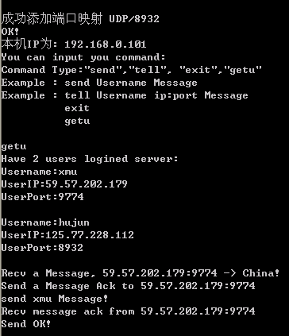
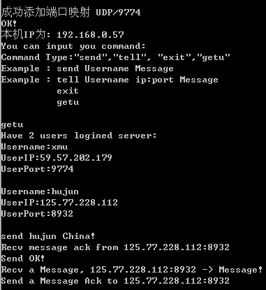

---
title: NAT与UPNP技术
date: 2023-7-13 21:19:14
tags: 计网
---

大佬的一篇论文，自用

<!-- more -->

                实践与经验

P2P 网络中 UPnP 穿越 NAT 的研究与实现

胡 军 1 ， 周剑扬 2 ， 师 佳 1

（1. 厦门大学信息科学与技术学院自动化系， 厦门 361005； 2. 厦门大学信息科学与技术学院电子工程系，厦门 361005）

摘 要： NAT 的存在使得 P2P 通信存在极大的障碍, 因此穿透 NAT 已经成为 P2P 应用必须面对和解决的问题。 为此，介绍一种使用 UPnP 技术穿越 NAT 的技术，该方法主要是利用 UPnP 中自动端口映射技术来构建一种静态传输映射来实现,并给出采用简单、稳定而且易于实现的 UPnP 中自动端口映射技术穿透 NAT 的实例。

关键词： NAT； UPnP； 自动端口映射； 静态传输映射

0. 引 言

在 IPv4 的地址空间中， 为了解决网络资源的问题，常常使用网络地址转换来实现地址的重用；这样就产生了我们通常所说的内网 IP （处在 NAT 后面的 IP）， 这样形成的网络架构给网络节点的通信带来了问题：① 内网的 IP 不能被外网识别，外网的节点不能主动的访问内网的节点； ② 内网的节点可以访问公网，但是不能作为服务端为公网提供服务。 针对这种情况， 人们提出了一些穿越 NAT 来应用 P2P 技术的解决方案，常见的有服务器转发技术、反向连接技术以及 UDP 打洞技术， 然而这三种技术都能实现 NAT 的穿越。

0. UPnP 穿越 NAT 的原理与实现

UPnP 穿越 NAT 的实现原理如下：首先在内网节点（客户端）分别通过软件程序在各自的 NAT 中建立一个自动端口映射信息，然后由内网节点（客户端）分别向一个公网的节点（服务器）注册自己的端口映射信息，并保存在服务器上；当内网节点 A 想与当内网节点 B 进行通信时，只需要通过在公网的节点（服务

现 器）上获取对方的端口映射信息，并向对方的映射端

代 口发送信息就能实现 NAT 的穿越。

计 1.1 自动端口映射部分的程序设计

算 按照 UPnP 的相关协议和规范，UPnP 的工作过

机 程包括寻址、发现、描述、控制、触发和展示 6 个部分。

总

（

设备首先通过寻址来获得一个网络地址。

第 然后， 第一步是发现， 控制点在网上寻找 UPnP

三

一

三 收稿日期：2009-05-07 修稿日期：2009-05-18

 设备，而设备向网络中的控制点宣告其服务。 对于自动端口映射来说就是发现支持 UPnP 功能的路由器。发现的过程如下： 首先是使用数据报套接字向 239.255.255.250：1900，发送一条多播请求，如果网络中存在一个 UPnP 设备的话，设备必须向发送查找请求的多播通道的源 IP 地址和端口发送相应信息；因此，我们可以从 239.255.255.250：1900 这个地址收到相应消息并可以获得设备描述 URL；

第二步是描述，在第一步中我们能够获得设备描

述 URL，在第二步中通过这个 URL 下载一个 XML 的文件，并从其中找到有关设备的类型、服务类型、控制 URL 和事件触发等信息；

第三步是控制，由第二步获得的控制 URL，通过向其发送控制消息（XML 描述）来实现控制功能，在此，我们主要是实现查看、增加、删除自动端口映射；

第四步和第五步分别是触发和展示，在我们实现自动端口映射过程中没有用到。

根据以上思路，用 C++语言实现了自动端口映射部分的程序，并将查看、增加、删除自动端口映射的功能封装成一个 upnpd.dll 的一个动态连接库， 主要包括 addportmapping、delportmapping 和 getportmapping 函数来建立、删除和获得端口映射关系。

2. 服务器端程序设计

服务器端功能主要是记录客户端的端口映射信息，读取客户端登录和登出的消息，以及转发客户端获取客户列表的申请等。这样大大地减轻了服务器的工作量， 不会像服务器转发技术穿越 NAT 那样给服务器很大的工作量并将全面依赖消耗服务器的资源

期 作者简介： 胡军（1984-），男，四川蓬安人，硕士，研究方向为嵌入式系统及计算机网络控制

）

貋貙貥



M O D E R N C OM P U T E R 2009.8

Socket

` `! "

和性能以及网络带宽。

图 1 服务器端程序流程图

2. 客户端程序设计

客户端的主要功能如下： 首先创建一个本地 Socket 并绑定到本机的一个固定端口（例如 8080），连接服务器， 同时请求服务器并获得经过 NAT 转换后

 的端口号（例如 8081），判断本机的 IP 是否是在局域网内， 如果是则调用增加自动端口映射函数 ad- dportmapping（8081，“TCP”或者“UDP”,8080）来建立自动端口映射；如果本机是公网的固定 IP 则不用进行自动端口映射。 然后通过 Getu 命令获得客户登录的列表，通过 Send 命令就可以实现两个不同客户端之间的通信了，Exit 命令删除添加的映射端口并退出程序。

0. 应用实例

考虑如下所示的网络结构， 实例采用 UDP 进行连接（如图 3）。

首先在公网的固定 IP 上运行服务器端的程序，并记录其固定 IP； 然后在两个不同的 NAT 后面运行客户端程序，输入服务器 IP 和用户名，登录成功后会返回登录的用户信息并进行判断是否增加自动端口映射， 如果在 NAT 后面会增加自动端口映射并提示增加的端口映射号， 最后等待用户输入命令，Getu、 Send、Exit 分别用于获取用户列表、 向指定用户发送信息和退出程序。

图 2 客户端程序流程图



M O D E R N C OM 

第三一三期

）

貦貙貋

图 3 实例网络结构

其运行程序结果如下：

 由以上的运行结果可以看出，P2P 的通信成功的实现了。

0. 结 语

本文实现了使用 UPnP 中的自动端口映射功能进行 NAT 的穿越， 此方案能够适用于不同客户端位于单个 NAT 后面的多种情况， 同时本方案所实现的 UPnP 对 NAT 的传输映射是静态的，也就是说经过一段时间后，如果客户端不再发送或接收数据，这种映射关系不会自动解除，端口号也不会被 NAT 收回，这样保证了能够建立稳定和可靠的的端口映射关系，实现了 P2P 网络中的直接通信。

参考文献

1. `	`UPnP 论坛贡献成员. PnP 设备架构[S]. UPnP 标准组织委员会，2000：2-11
1. `	`林丽闽，别红霞等译. 标准 C++宝典[M]. 北京：电子工业出版社，2001
1. `	`Bryan Ford， Pyda Srisuresh，Dan Kegel. Peer-to-Peer(P2P) Communication Across Network Address Translators(NATs) [DB/OL]. <http://www.brynosaurus.com/pub/net/internet-> drafts/draft-ford-midcom-p2p-03.txt，2004-12-12
1. 李河,王树明. P2P 网络中使用 UDP 穿越 NAT 的方法研

究[J]. 吉林大学学报(信息科学版), 2003,21(3)

1. 刘扬，董开坤，刘杨，迟乐军. 对等网络中穿越 NAT 解决方案的研究[J]. 计算机工程与设计，2008，6(29)

图 4 用户 hujun 图 5 用户 xmu

Research and Implementation of Traversing NAT Using UPnP under P2P Network Environment

HU Jun1 ， ZHOU Jian-yang2 ， SHI Jia1

现代计算机

（总

第三一三期

）

貋貙貧



（1.Department of Automation, Xiamen University, Xiamen 361005;

\2. Department of Electronic Engineering, Xiamen University, Xiamen 361005）

Abstract： The existing of NAT proves a great obstacle to the P2P communication, so how to traverse NAT has become a problem to be faced and solved in the application of the P2P. Therefore,

introduces a technique of the using UPnP to traverse NAT. This method mainly uses the au- to-port-mapping in the UPnP employed to build a static-transmitting-mapping to achieve the traversing. It also gives a good example to show how to use the auto-port-mapping technique, which is the simpler, stabler and more achievable in the UPnP to traverse NAT.

Keywords： NAT; UPnP; Auto-Port-Mapping; Static-Transmitting-Mapping

M O D E R N C OM P U T E R 2009.8
